		编译器：把高级语言程序翻译成计算机能理解的机器语言指令集的程序。

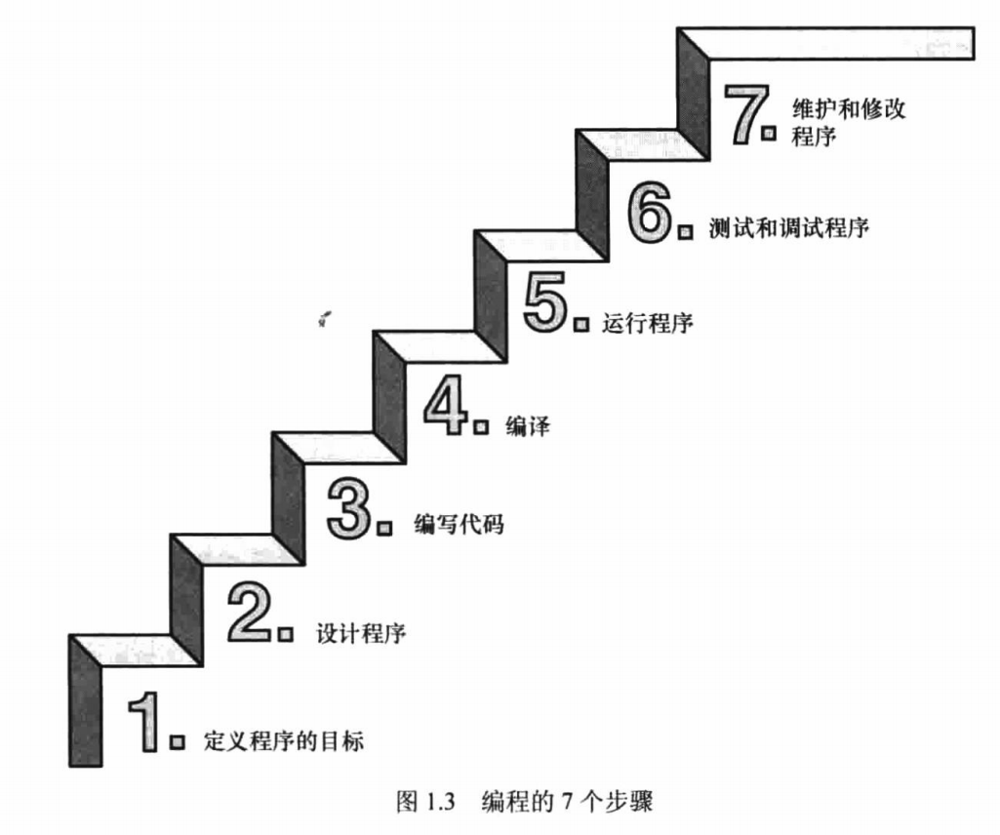

​		C语言的文件后缀名为 ".c"，C++的后缀名为 ".cpp"。

​		C变成的基本策略：用程序将源代码文件转换为可执行文件（其中包含可直接运行的机器语言代码）。典型的C实现通过编译和链接两个步骤来完成这一过程。编译器把源代码转换成中间代码，链接器把中间代码和其他代码合并，生成可执行文件。链接器还将源代码和预编译的库代码合并。

​		把源代码转换为机器语言代码，并把结果放在目标代码文件中。虽然目标文件中包含机器语言代码，但是并不能直接运行该文件。因为目标文件中存储的是编译器翻译的源代码，这还不是一个完整的程序。

​				1、目标代码文件确实启动代码，启动代码充当着程序和操作系统之间的接口。

​				2、目标代码还缺少库函数，几乎所有的C程序都要使用C标准库中的函数。目标代码中并不包括该函数的		代码。

​		链接器：将编写的源代码文件，系统的标准启动代码和库代码3部分合并成一个文件，即可执行文件。对于库代码，链接器只会把程序中要用到的库函数代码提取出来。

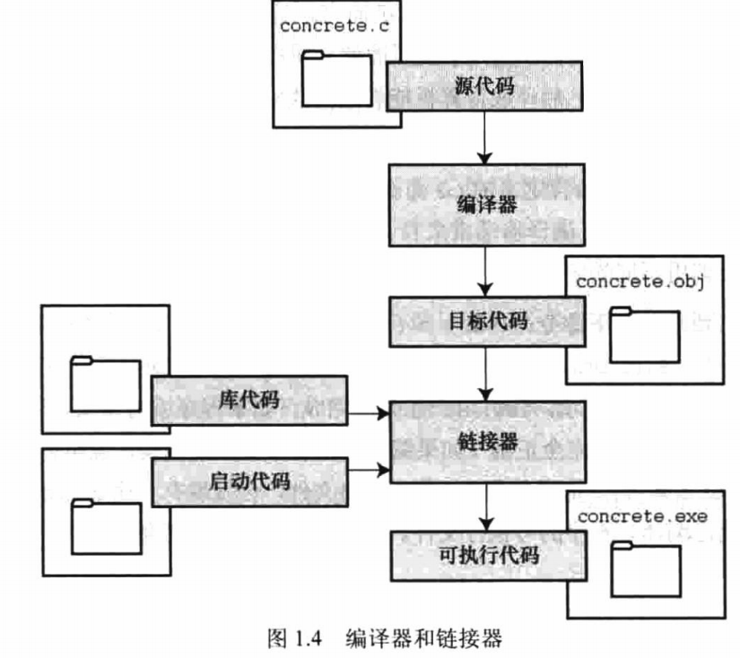

​		目标代码处理过程：C编译器会创建一个与源代码基本名相同的目标代码文件，其扩展名为 ".o"。一旦链接器生成了完整的可执行程序，就会将其删除。

​		通常，编译器生成的中间目标代码文件的扩展名为 ".obj"。在完成编译之后通常不会删除这些中间文件 。

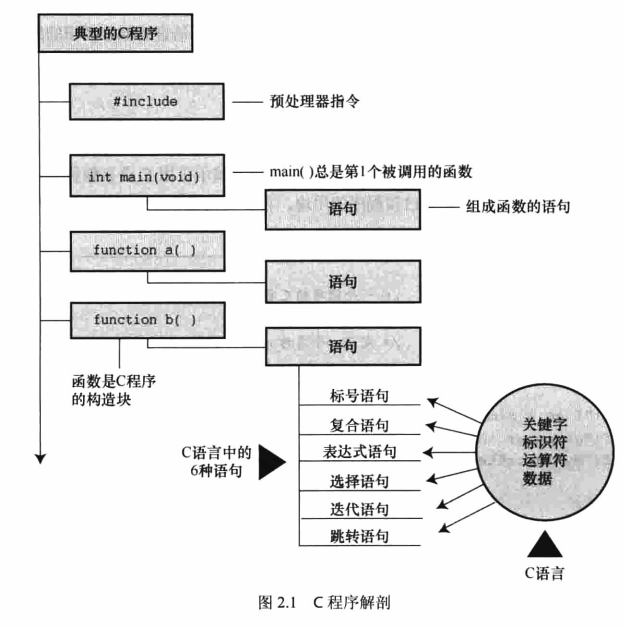

​		声明：将标识符与计算机内存中的特定位置联系起来，同时也确定了存储在某 位置的信息类型和数据类型。

​		粗体是C90标准新增的关键字，斜体表示C99标准新增的关键字，粗斜体表示是C11标准新增的关键字。

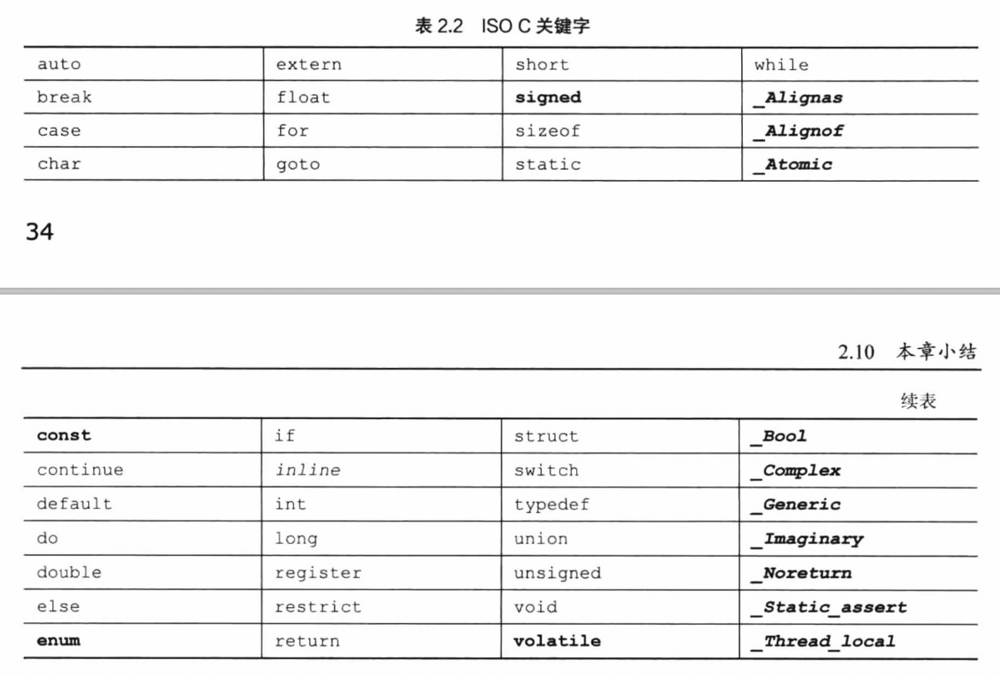

## 数据类型

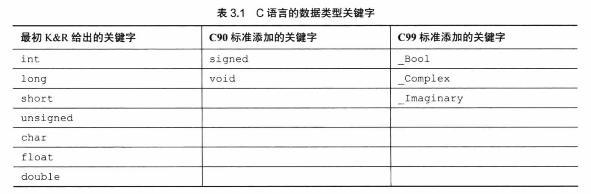

​		 _ Bool类型表示布尔值， _ complex和_Imaginary分别表示复数和虚数。

​	

​		位：最小的存储单元（bit），可以存储0和1。

​		字节：常用的计算机存储单位，1字节均为8位。字节的标准定义。

​		字：设计计算机时给定的自然存储单位，对于8位的微型计算机1个字长只有8位。

### 整数类型

​		int类型是有符号整型，必须是整数。类型大小一般为4个字节（即一个机器字长），取值范围大致为：-2^31~2^31 - 1。

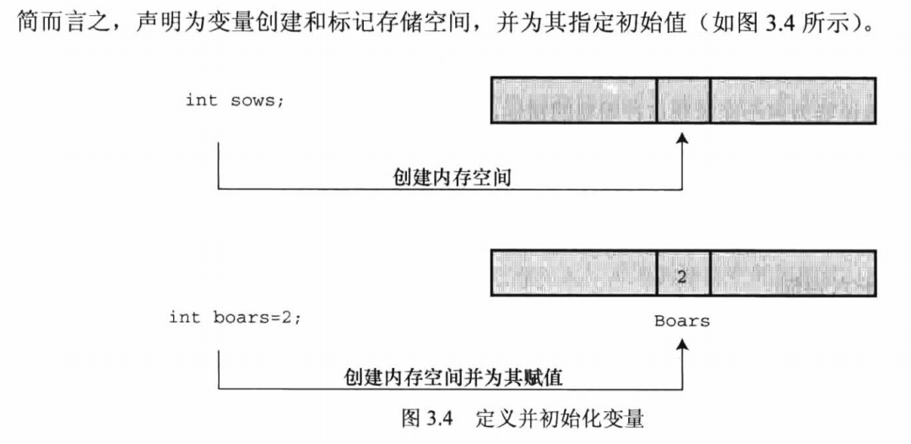

​		不同进制表示：

​				十六进制：0x或者0X为前缀。

​				八进制：0为前缀。

​		不同进制打印：

​				%d：十进制。

​				%o：八进制。

​				%x：十六进制。

​		如要显示进制前缀则用对应的%#d，%#o，%#x。显示转换时后缀只能小写。即：%ld，%lo，%lx。


​		3个附属关键字修饰基本整数类型：short，long，unsigned。

​				short  int类型（简写为 short）：占用的存储空间可能比int类型少，常用于较小数值的场合以节省空		间。与 int 类似，short是有符号整型

​				long  int 或 long占用的存储空间可能比int多，适合与较大数值的场合。与int类似，long是有符号类型。

​				long  long  int 或long  long（C99标准加入）：占用的存储空间可能比long多，适用于更大数值的场		合，该类型至少占8个字节，与int类似，long  long是有符号类型。

​				unsigned int 或 unsigned：只用于非负值的场合，这种类型与有符号类型表示的范围不同。

​				C90标准中：添加了 unsigned  long  int或unsigned  long ，unsigned  int或unsigned  short类型。

​				C99标准中：添加了 unsigned  long  long  int或unsigned  long  long。

​				在任何有符号类型前面添加关键字  signed，可强调使用有符号类型的意图。

​		C语言只规定可 short占用的内存不能多于 int，long 占用的内存不能少于 int。是为了适应不同的机器。

​		在较小的 int 的字面常量后面加上 l（小写的L）或者 L ，此时，字面常量的类型将变为 long。

​				long  long ：ll 或者 LL。

​				unsigned  long  long：u  或者 U。

​		不同类型的转换字符：

​				unsigned  int：%u。

​				unsigned  long：%lu。

​				unsigned  long  long：%llu。


​				short  int（short）：%hd。

​				十六进制  short：%hx。

​				八进制 short：%ho。


​				long  int（long）：%ld。

​				十六进制 long：%lx。

​				八进制 long：%lo。


​				long  long ：%lld。

### 字符类型

​		char类型用于存储字符，占一个字节。从技术层面看，char是整数类型，因为char类型实际上存储的是整数而不是字符。计算机使用特定的整数来表示特定的字符。

​		字符常量：用单引号括起的单个字符。

​		给 char 类型变量赋值：既可以用字符常量，也可以用字符常量对应的整数。

​		如果用单引号括起多个字符给 char 类型变量赋值，那么变量存储的是最后一个字符的值。

​		**转义字符**：使用特殊的符号序列表示一些特殊的字符。将转义字符赋值给字符类型时，必须用单引号括起来。

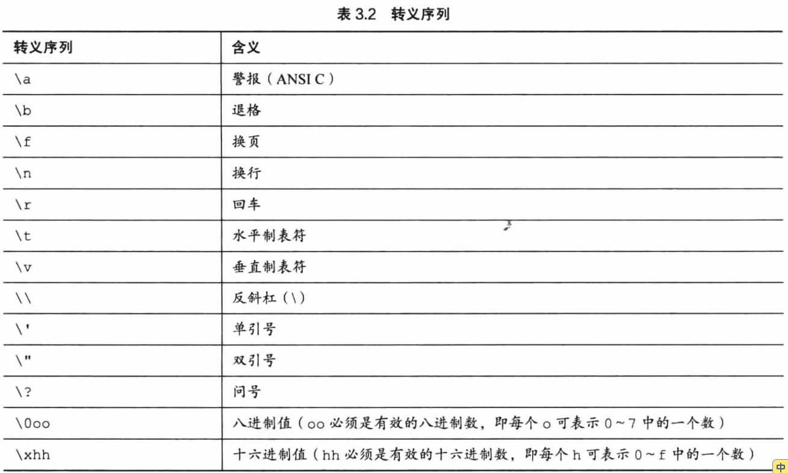

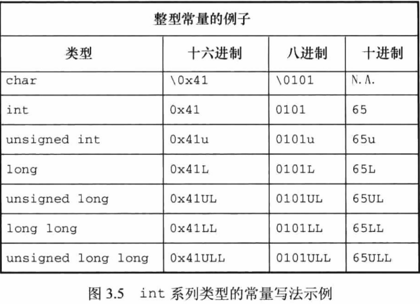

​		数字与数字字符的区别：

​				4：数值

​				'4'：数字字符

​		打印字符：%c。

### _Bool类型

​		C99标准新加了：_Bool类型，用于表示布尔值，即逻辑值 true和false。但因为C语言用**非0表示true（打印true为 1），0表示false（打印false为0）**，所以 _Bool类型实际也是一种整数类型。占 1位（即1个比特位）。

### 浮点数类型

​		float：4个字节，有效位数6，即至少能精确表示小数点后6位。打印：%f。

​		double:：8个字节，有效位数13，即至少能精确表示小数点后13位。打印：%f。

​		使用指数表示法表示浮点型常量：可以没有小数部分和指数部分，但同时省略两者；可以省略小数部分或整数部分，但不能同时省略两者。默认情况：浮点型常量为 double 类型。表示 float类型的浮点型常量，可以在常量后面加上 f 或 F。

​		用指数表示法打印：%e。

### 类型大小

​		sizeof 运算符，转换说明：%zd。


​		把一个类型的数据初始化给不同类型的变量时，编译器会把值装换成与变量匹配的类型，这将导致数据丢失。

​		printf和scanf函数用第一个参数表明后续有多少个参数，即第一个字符串中的转换说明与后面的参数一一对应。

## 输出

​		最初，printf语句把输出发送到一个叫做缓冲区的中间存储区域，然后缓冲区中的内容再不断地被发送到屏幕上。C标准明确规定了可是把缓冲区的内容发送到屏幕：当缓冲区满，遇到换行字符或者需要输入的时候。将数据从缓冲区发送到屏幕或文件的行为称为：刷新缓冲区。

​		另一种刷新缓冲区的方法：fflush()函数。

## 字符串和格式化输入/输出

### 字符串

```c++
#include <stdio.h>
#include <string.h>

#define DENSITY 62.4

int main()
{
    float weight,volume;
    int size_of,letters;
    char name[40];  //最多输入39个字符，最后一个字符为字符串结束字符'\0'
    printf("hi! what`s your first name?\n");
    
    //%s：字符串的输入输出格式，scanf的第二个参数是一个地址引用，因为数组名本身就是一个引用，所以不用加&符号，在存储时，存入数组的字符的数量是字符串长度+1，最后一个为“\0”，表示字符串结束符，所以字符串的最大长度应是数组长度-1
    scanf("%s",name);
    printf("%s,what`s your weight in pounds?\n",name);
    scanf("%f",&weight);
    size_of = sizeof name;
    
    //strlen函数在string.h头文件中，用于返回字符串的长度而不是存储字符串的数组的长度
    letters = strlen(name);	
    volume = weight / DENSITY;
    
    //%s表示要打印一个字符串
    printf("well,%s,your volume is %2.2f cubic feet.\n",name,volume);

    printf("also,your first name has %d letters,\n",letters);

    printf("and we have %d bytes to store it.\n",size_of);


    return 0;
}
```

​		sizeof ：以字节为单位返回变量的大小，函数后面的圆括号的使用时机取决于运算对象是类型还是特定量，运算对象是类型时，圆括号必不可少，但对于特定量，可有可无。但就算如此，还是建议所有情况下都使用圆括号。

​		C语言没有专门用于存储字符串的变量类型，字符串都被存储在char类型的数组中。

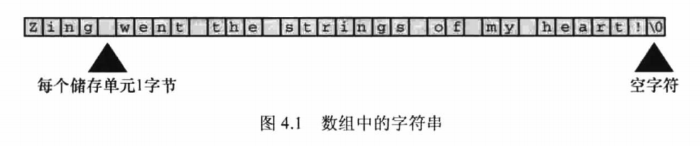

​		末尾的字符'\0'，是空字符，C语言用它标记字符串的结束。

​		**数组：同类型数据元素的有序序列。**


​		scanf("%s",name)：在读取输入时，会在读取的字符串最后自动加上'\0'。

​		

​	'x' 与 "x" 的区别：

​			'x'：基本类型。

​			"x"：字符数组类型，有两个字符 'x' 和 '\0' 两个字符组成。

​	

```c++
#include <stdio.h>
#include <string.h>

#define  PARISE "You are an extraordinary being."

int main()
{
    char name[40];

    printf("What`s your name? ");
    scanf("%s",name);

    printf("Hello,%s. %s\n",name,PARISE);

    printf("Your name of %zd letters occupies %zd memory cells.\n",strlen(name),sizeof(name));

    printf("The phrase of praise has %zd letters ",strlen(PARISE));

    printf("and occupies %zd memory cells.\n",sizeof(PARISE));

    return 0;
}
```

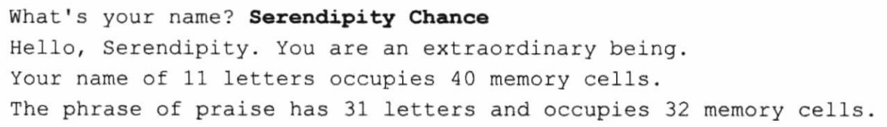

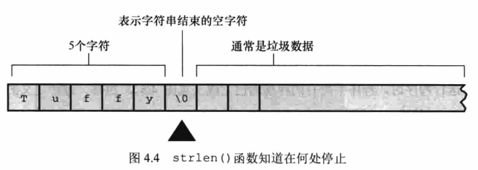


### 预编译（编译时替换）

​		格式：#define  NAME  value

​		**末尾没有分号，NAME 和 value中间也没有 = 符号**

​		

​		#define  PI  3.1415 ：编译时程序中所有的 PI 都会被替换成 3.1415。


​		**const关键字：限定变量为只读。**一旦定义后，程序中可以打印，可以使用，但是不能修改。

### 明示常量

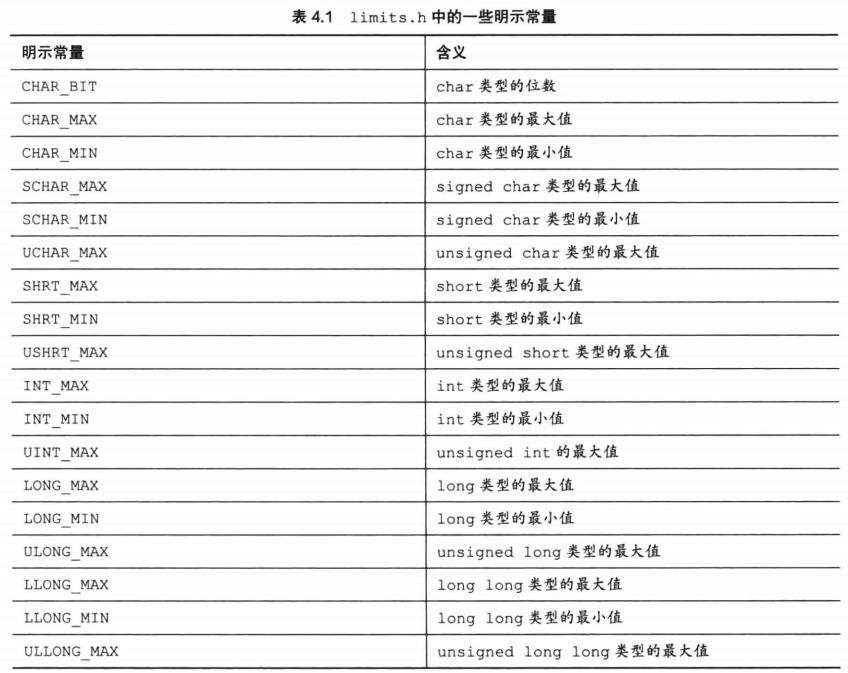

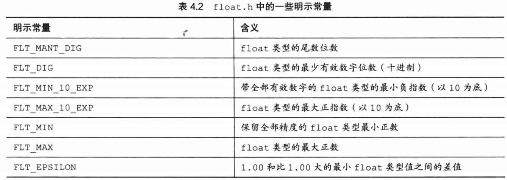


​		请求printf()函数打印数据的指令要与待打印数据的类型相匹配，这些符号被称为转换说明。它们制定了如何把数据转换成可现实的形式。

​		printf() 函数格式：

​				printf(格式化字符串，打印项1，打印项2...)

​						打印项1，打印项2...：要打印的项，可以是变量，常量，甚至可以是在打印之前要计算的表达式。				而格式化字符串中应包含每个待打印项对应的转换说明。

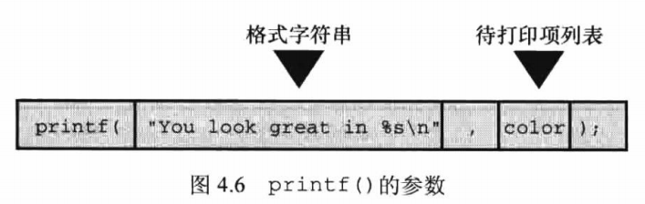

### 转换说明

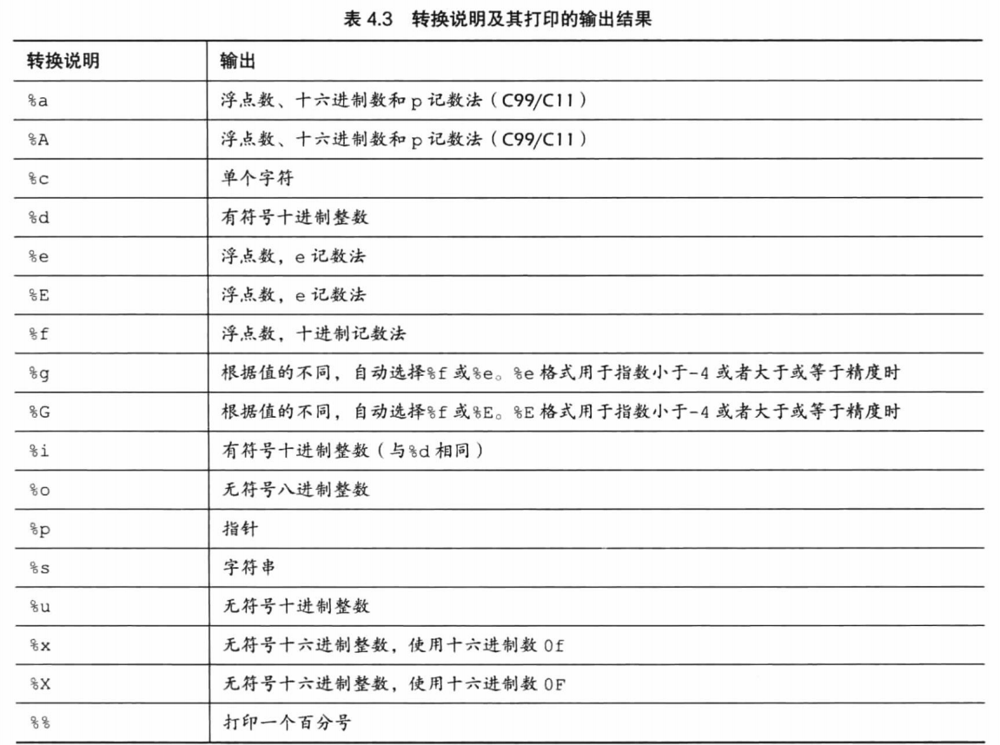


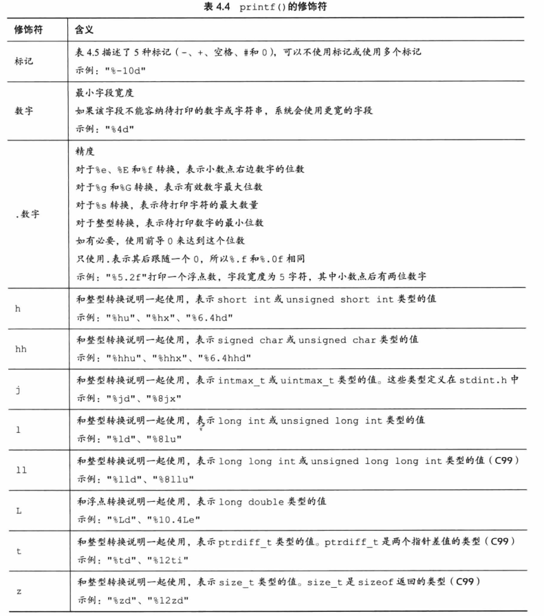

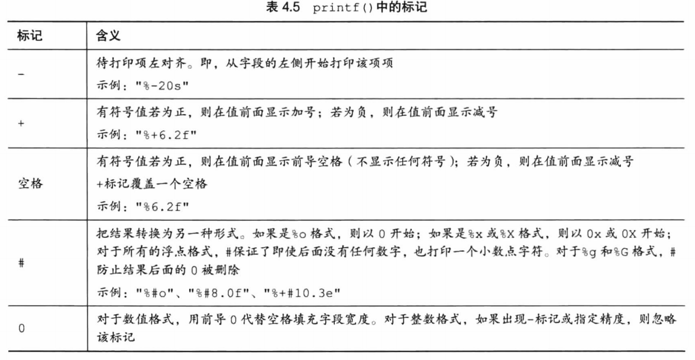

​		

​		**参数传递机制：**

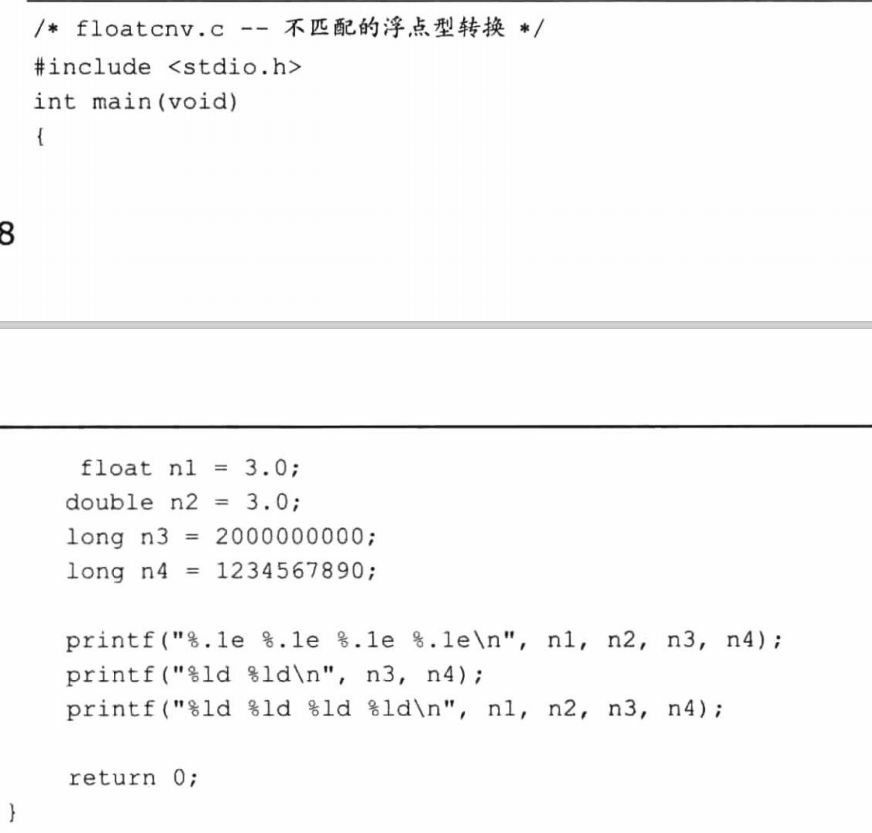

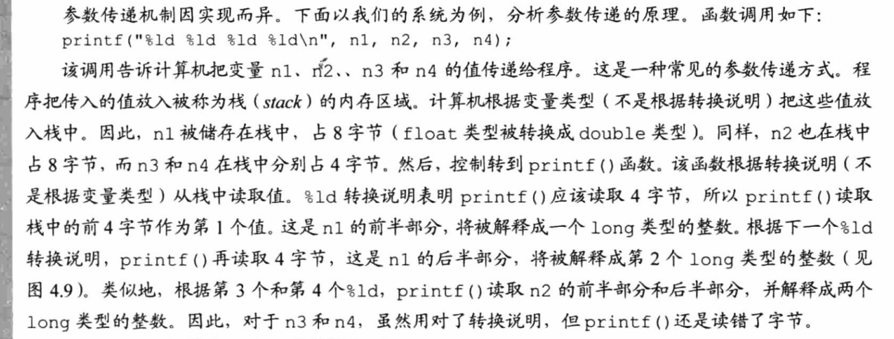

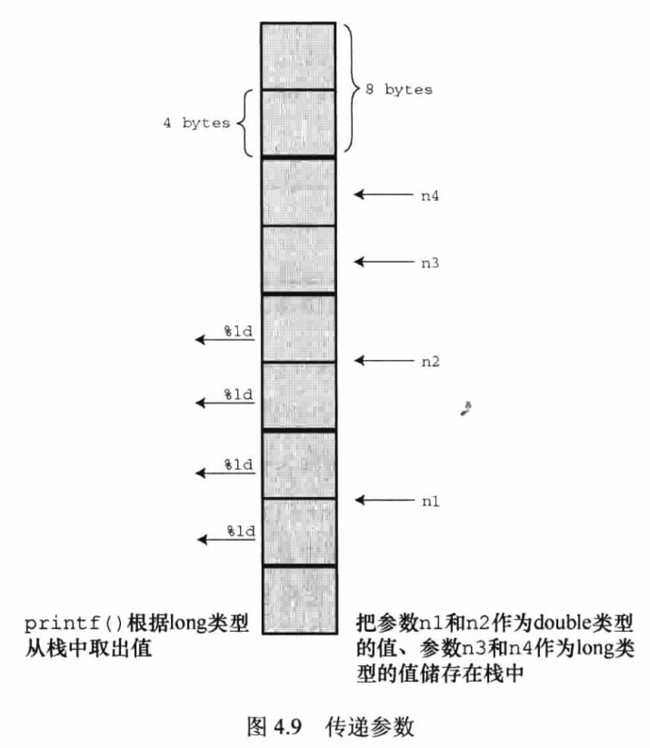

​		printf()：返回值是打印的字符的个数，如果有输出错误，则返回一个负值。

​	


​		scanf()：将输入的字符串转换成整数，浮点数，字符或字符串。与printf类似，也需要使用格式化字符串和参数列表。其中格式化字符串表明字符输入流的目标数据类型。

​		与printf主要的区别：在于参数列表。

​				printf：使用变量，常量和表达式

​				scanf：使用指向变量的指针，即如果读取基本的值，变量前需加上 "&" 符号，如果是数组等其他类型，		不要加此符号。

​		scanf：使用空白符号将输入分成多个字段。在依次把转换说明和字段匹配时跳过空白。但是使用 "%c" 作为转换说明时，并不会跳过空白字符，而是将其作为一个字符读入。


​		printf 打印 float，double 类型时都使用可以转换说明 "%f，%e,，%E，%g，%G"；而对于scanf函数，它们只用于 float 类型，double 类型需要使用修饰符 "l"。


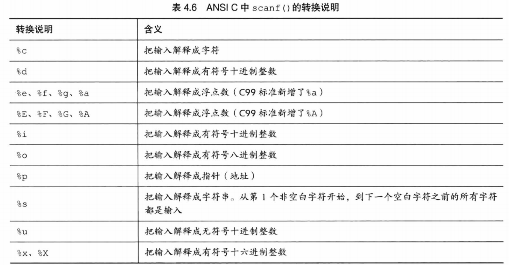


​		修饰符：

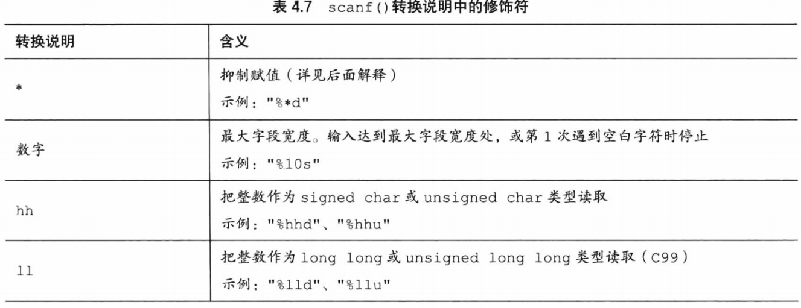

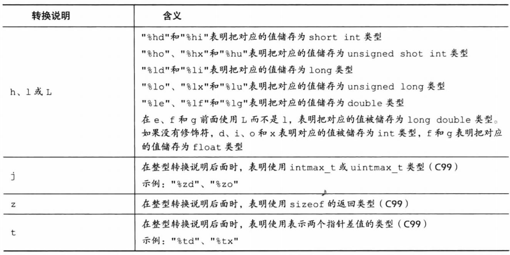

​		

​		以 "%d" 转换说明读取一个整数：scanf 函数每次读取一个字符，跳过所有的空白字符，直至遇到第一个非空白字符才开始读取。因为要读取整数，所以 scanf 函数希望发现一个数字字符或者一个 ( - 或 + ) 字符。如果找到一个数字或符号，它便保存该字符，并读取下一个字符。如果下一个字符是数字，它便保存该数字 并读取下一个字符。不断读取和保存字符，直至遇到非数字字符。如果遇到一个非数字字符，便认为读到了整数末尾，然后，scanf 函数把非数字字符返回输入，这意味着程序在下一次读取输入时，首先读取到的是上一次读取丢弃的非数字字符。最后，scanf 计算以读取数字相应的数值，并将计算后的值放入指定的变量中。

​		如果使用字段宽度，scanf 函数会在字段结尾或第一个空白字符处停止读取。

​		如果第一非空白字符不是数字，那么 scanf 将停在哪里，并将其放回输入中，不会把值赋给指定变量。程序在下一次读取输入时，首先读到的还是这个非数字字符。如果 scanf 带多个转换说明，将在第一个出错处停止读取输入。


​		scanf  允许把普通字符放在格式化字符串中，除空格字符外的普通字符必须与输入字符串严格匹配。


​		scanf("%c",&m)与scanf("  %c",&m)的区别：前者从输入的第一个字符开始读，后者会跳过最开始的空格，从第一个非空字符开始读。


​		scanf 返回成功读取的项数。没有读取任何项，将返回0。


"*" 在 printf 和 scanf 中的区别：

​		printf：如果不想预先指定字段宽度，而是通过程序执行，可以用 * 修饰符代替字段宽度，但还是要用参数告诉函数，字段宽度是多少。

```c
printf("%*d",width,result); //width:为字段宽度，result：真正要打印的值
```

​		scanf ：把 * 放在转换说明之间，scanf 会跳过相应的输入项。

```c
scanf("%*d %*d %d",&n); //如果输入：55 32 20 ，最后 n 的值为20
```


## 运算符，表达式和语句

​		"="：赋值运算符，左侧必须引用一个存储一个位置，通常是一个变量。

​		"/"：除法运算，浮点数除以浮点数是浮点数；整数除以整数是整数，即丢弃小数部分，**不是四舍五入**。整数除以浮点数，或者浮点数除以整数，结果是浮点数。

​		"%"：求模运算，只能用于两个整数取模的运算，如果其中有一个是负数，那么如果负数在前，结果为负数，如果正数在前，结果为正数。即 a%b = a - (a / b) * b

​		递增运算符和递减运算符（--，++）：优先级仅次于括号。

​		每一个表达式都有返回值，赋值表达式的值与赋值运算符左侧变量的值相同。

### 类型转换：

​		1、当类型转换出现在表达式中，无论是unsigned还是signed的char和short都会被自动转换成int。

​		2、设计两种类型的运算，两个值会被分别转换成两种类型的更高级别。

​		3、类型的级别从高到低：long  double，double，float，unsigned long，long long，unsigned long，long，unsigned int，int。short和char会被自动升级为int。

​		4、在赋值表达式语句中，计算的最终结果会被转换成被赋值变量的类型，这个过程可能导致类型升级或降级。

​		5、当作为函数传参数传递时，char和short会被转换成int，float被转换成double。

​		待赋值的值与目标类型不匹配时：

​				1、目标类型是无符号整型，且待赋的值是整数时，额外的位将被忽略。

​				2、如果目标类型是一个有符号整型，且待赋的值是整数，结果因实现而异。

​				3、如果目标类型是一个整型，且待赋的值是浮点数，该行为是未定义的。

​		浮点数转为整数：直接舍弃小数部分。

​		强制类型转换：在某个量的前面放置用圆括号括起来的类型名，该类型名即是希望转换成的目标类型，圆括号和它括起来的类型名构成了强制类型转换运算符。

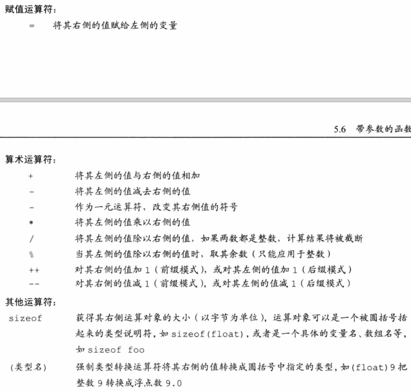

```c++
#include <stdio.h>

const int S_PER_M = 60;
const int S_PER_H = 3600;
const double M_PER_K = 0.62137;

int main()
{
    double distk,distm;
    double rate;
    int min,sec;
    int time;
    double mtime;
    int mmin,msec;

    printf("this program converts your time for a metric race\n");
    printf("to a time for running a mile and to your average\n");
    printf("speed in miles per hour.\n");

    printf("Please enter,in milometers,the distance run.\n");

    scanf("%lf",&distk);

    printf("next enter the time in minutes and seconds.\n");

    printf("begin by entering the minutes.\n");

    scanf("%d",&min);
    printf("now enter the seconds.\n");
    scanf("%d",&sec);

    time = S_PER_M * min + sec;
    distm = M_PER_K * distk;

    rate = distm / time * S_PER_H;

    mtime = (double)time * distm;

    mmin = (int)mtime / S_PER_M;

    msec = (int)mtime % S_PER_M;

    printf("you ran %1.2f km (%1.2f miles) in %d min,%d sec.\n",distk,distm,min,sec);

    printf("that pace corresponds to running a mile in %d min, ",mmin);

    printf("%d sec.\nyour average speed was %1.2f mph.\n",msec,rate);

    return 0;
}
```

## 循环

​		创建一个循环中涉及三个行为：

​				1、必须初始化计数器

​				2、计数器要与有限的值作比较

​				3、每次循环是更新计数器。

​		while：

```c++
while( 条件表达式 )
{
    循环体
}

/**
当条件表达式为真（或者一个非零值或变量），则执行循环体，然后继续判断条件表达式，周而复始，直到条件表达式为假（或者一个等于零的值或变量），才退出循环。执行循环后的语句

上述的三个行为：
初始化必须在while循环之前
比较则是while循环中的条件表达式
更新计数器则在循环体内部

**/

int count = 1;

while(count < 5)
{
    count++;
}
```

​		在构建while循环时，必须让测试表达式的值有变化，表达式最终要为假。否则会陷入死循环。并且只有在对测试条件求值时，才决定时终止还是继续循环。

​		**只有在测试条件后面的单独语句或者用花括号括起来复合语句的才是循环部分，并且条件表达式的括号后面没有分号**。

​		关系表达式只有两个返回值：真（1），假（0）。

​		当用数字字面量或者变量作为条件表达式时，非0为真，0为假。

​		当使用形如：count == 5，这样的条件表达式时，如果把 == 错写为 = ，那么将导致死循环，好的做法是，将数字字面量写在比较运算符前面，即：5 == count。

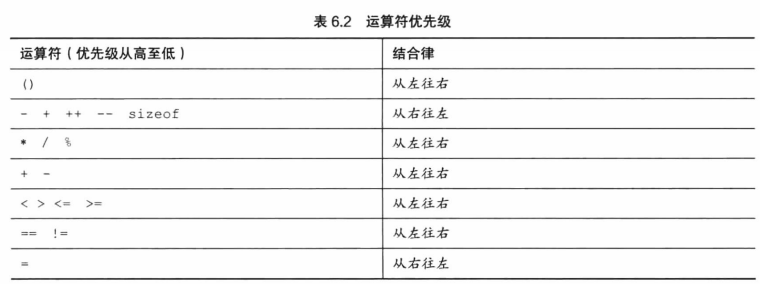


​		for：

```c++
for(表达式1 ; 表达式2 ; 表达式3)
{
    循环体
}

/*
表达式1：对应计数器的初始化，可以省略，省略后，计数器的初始化必须在for循环之前，此表达式只会在循环开始之前执行一次
表达式2：对应比较，即应该是一个关系表达式，省略后，默认真（1），在循环开始前执行，每次循环结束后，会再次执行
表达式3：一般为计数器的更新，省略后，必须在循环体内部更新计数器，执行完循环体后执行此表达式，完成后，才是一次完整的循环。

两个分号不能省略

*/


for(int i = 0 ; i < 100 ; i++)
{
    printf("ffff");
}
```

​		逗号运算符：

​				1、它保证了被它分隔的表达式从左到右求值。

​				2、整个逗号表达式的值是右侧表达式的值。

​		do  while：

```c++
do
{
    循环体
}
while(条件表达式);

/*
	在条件表达式的括号后，以分号结尾
*/
```

​		do  while也被称为出口条件循环，即先执行执行循环体，在判断循环条件。所以其特征是循环至少执行一次。

### 数组

​		数组是按顺序存储的一系列类型相同的值，整个数组有一个数组名，通过整数下标访问数组中单独的项或元素。数组的下标从0开始。

```c++
int arr[20];
/*
	声明一个含20个整型元素的数组，可以访问的下标为0~19。
*/
```

## 分支和跳转

​		getchar()：从输入队列中返回下一个字符。

​		putchar()：打印给它传递的字符参数。

​		它们不要转换说明，只处理字符数据。

​		ctype.h 头文件中包含一些专门处理字符的函数，这些函数接受一个字符作为参数，如果该字符属于某特殊的类别，就返回一个非零值；否则，返回0。

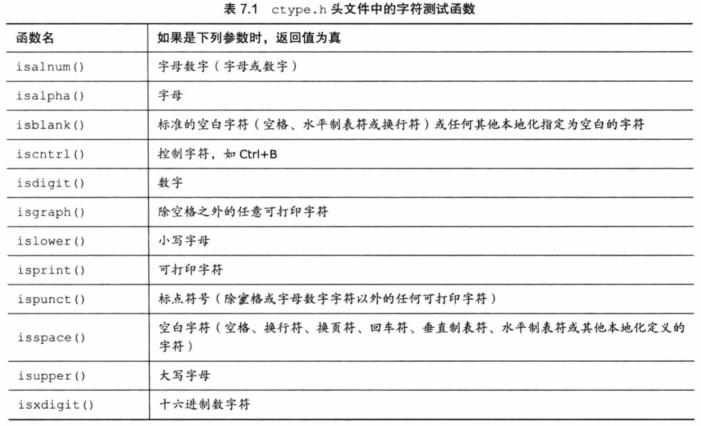

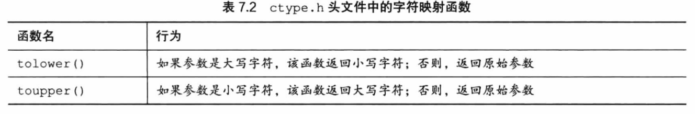

​			字符映射函数不会修改原始的参数，这些函数只会返回已修改的值。

```c++
#include <stdio.h>
#include <ctype.h>

int main()
{
    char ch;

    while((ch = getchar()) != '\n')
    {
        if(isalpha(ch))
        {

            putchar(ch + 1);
        }
        else
        {

            putchar(ch);
        }
    }
    putchar(ch);

    return 0;
}
```

​	

​		if  else if：

```c++
#include <stdio.h>
#define PATE1 0.13230
#define PATE2 0.15040
#define PATE3 0.30025
#define PATE4 0.34025
#define BREAK1 360.0
#define BREAK2 468.0
#define BREAK3 720.0
#define BASE1 (PATE1 * BREAK1)
#define BASE2 (BASE1 + (PATE2 * (BREAK2 - BREAK1)))
#define BASE3 (BASE1 + BASE2 + (PATE3 * (BREAK3 - BREAK2)))
int main()
{
    double kwh;
    double bill;
    printf("please enter the kwh used.\n");
    scanf("%lf",&kwh);
    if(kwh <= BREAK1)
    {
        bill = PATE1 * kwh;
    }
    else if(kwh <= BREAK2)
    {
        bill = BASE1 + (PATE2 * (kwh - BREAK1));
    }
    else if(kwh <= BREAK3)
    {
        bill = BASE2 + (PATE3 * (kwh - BREAK2));
    }
    else
    {
        bill = BASE3 + (PATE4 * (kwh - BREAK3));
    }
    printf("the charge for %.1f kwh is %1.2f.\n",kwh,bill);
    return 0;
}
```

​		如果没有花括号，else 与离它最近的 if 匹配，除非最近的 if 被花括号括起来。


逻辑运算符

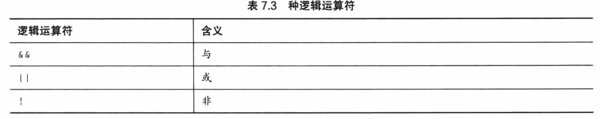

​		&&，||：双目运算符。

​		!：单目运算符。


​		test1 && test2：当  test1 与 test2 都为真时，test1 && test2 为真。并且，如果 test1 为假，则直接返回假，test2 并不会执行。

​		test1 || test2：当  test1 与 test2 都为假时，test1 || test2 为假。并且，如果 test1 为真，则直接返回真，test2 并不会执行。

​		!test：如果 test 为真，!test 为假；如果 test 为假，!test 为真。

​		引入 iso646.h 头文件，可以用 and 替换 &&，or 替换 ||，not 替换 !。

```c++
#include <stdio.h>
#include <iso646.h>
#define end '.'

int main()
{
    int count = 0;
    char ch;
    while((ch = getchar()) != end)
    {
        //if(ch != '"' && ch != '\'')
        if(ch != '"' and ch != '\'')
        {
            count++;
        }
    }
    printf("%d",count);
    return 0;
}

/*
	判断非空字符：引入 ctype.h 头文件，使用 isspace 函数，参数为一个字符类型的值。
*/
```


​		三目运算符： test ? x : y

​				如果 test 为真，则返回 x 的值，否则返回 y 的值。


​		continue：跳过本次循环剩余的部分，开始下一轮循环。对于 while 和 do while 来说就是执行决定是否继续循环的条件表达式，对于 for 来说就是执行更新计数器的表达式，即表达式3。


​		break：终止循环。即立即到循环后的语句继续执行。并且只会影响包含它的当前循环。


​		switch：

```c++
switch(n)
{
 	case x:
		表达式;
		break;
	case x:
		表达式;
		break;
	case x:
		表达式;
		break;
    ...
    //default 语句是可选的
    default:
        表达式;
        break;
}
```

​		先对 switch 后圆括号的表达式求值，然后扫描标签，即 case 后面的值，直到发现一个匹配的值为止，然后执行对应标签内的语句，遇到 break 就跳出 switch 模块。由此可以看出圆括号中的表达式的值应该是一个准确值，并且是一个整数类型的值，所以 case 后的标签也应是一个整数类型的值。如果没有匹配到对应的标签，此时：如果有 defautl，则执行 default 内的语句，如果没有则跳出 switch 模块。

​		break 语句必不可少，如果没有 break 语句，则匹配到对应的标签后，执行完其对应的语句后，会继续执行紧挨其后的 case 中的语句，直到碰到 break 语句或者 switch 块末尾。并且匹配的顺序是先 case，再 default，就算 default 写在模块开头也是如此。


​		goto：由两部分组成，goto 和标签名，表签名遵守命名规范。最好不要使用。

```c++
#include <stdio.h>
int main()
{
    printf("first\n");
    //程序会直接跳转到以 threed: 开头的语句继续执行
    goto threed;
    
    printf("second\n");
    
    threed:printf("threed\n");
    
    return 0;
}
```

## 字符输入/输出和输入验证

​		在进行输入操作时，大部分系统在用户按下 enter 键之前不会重复打印刚输入的字符，这种形式输入缓冲输入。用户输入的字符被手机并存储在一个被称为缓冲区的临时存储区中，按下 enter 键后，程序才可使用用户输入的字符。

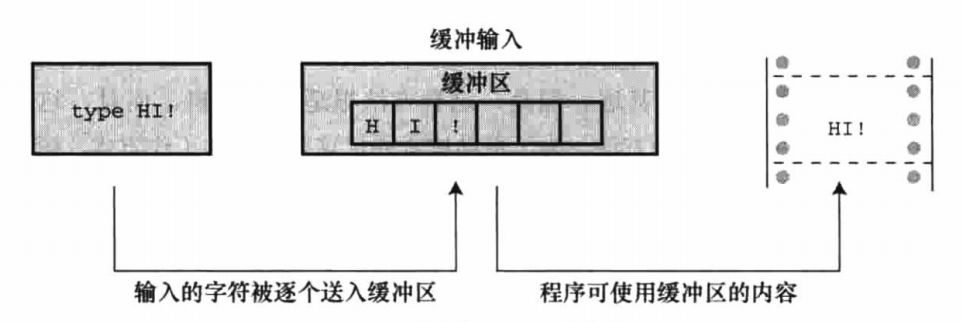

​		其作用：

​				1、将若干字符作为一个块进行传输比逐个发送这些字符节约时间。

​				2、如果打错字符，可以直接通过键盘修正错误。

​				当最后按下 enter 键时，传输的是正确的输入。

​		两类缓冲：

​				完全缓冲 I/O ：指的是当缓冲区被填满时才刷新缓冲区（内容被发送至目的地），通常出现在文件输入		中。缓冲区的大小取决于系统。

​				行缓冲 I/O：指的是在出现换行符时刷新缓冲区，键盘输入通常是行缓冲输入，所以在按下 enter 键后才		刷新缓冲区。

​		C 规定：输入是缓冲的。但某些 C 还是提供了无缓冲输入的选项，为其提供了一系列特殊的函数。原型在 conio.h 头文件中。这些函数包括用于回显无缓冲输入的 getche() 函数和用于无回显无缓冲输入的 getch() （回显输入意味着用户输入的字符直接显示在屏幕上，无回显输入意味着击键后对应的字符不显示）。


​		C语言中，用 getchar() 读取文件检测到文件结尾时将返回一个特殊的值，即EOF。 scanf 函数检测到文件结尾时也返回EOF。通常EOF定义在 stdio.h 头文件中。通常为：-1。


​		**不能将 scanf 和 getchar 混用**：

```c++
#include <stdio.h>
void display(char ch,int row,int line)
{
    for(int i = 0 ; i < row ; i++)
    {
        for(int j = 0 ; j < line ; j++)
        {
            putchar(ch);
        }
        putchar('\n');
    }
}
int main()
{
    int ch;
    int lines,rows;
    while((ch = getchar()) != '\n')
    {
        scanf("%d %d",&rows,&lines);
        if(lines > 0 && rows > 0)
        {
            display(ch,rows,lines);
        }
        /*
            没有这个循环，程序在输入第一行数据 按下回车后，程序将终止。
            原因是：当按下回车后，回车也会作为一个字符被发送给程序，然后回到 第一个 while循环处，由于赋值给 ch 的是回车字符，所以程序会判断为假，不继续执行循环
        */
        while(getchar() != '\n')
        {
            continue;
        }
    }
    return 0;
}
```


## 函数

​		函数是完成特定任务的独立程序代码单元

```c++
#include <stdio.h>
#define NAME "GIGATHINK,INC."
#define ADDRESS "101 Megabuck Plaza"
#define PLACE "Megapolis,CA 94904"
#define WIDTH 40

//函数原型：告诉编译器函数的类型
void starbar();
int starbar_n(int n);

int main()
{
    //调用函数：在此处执行函数
    starbar();
    printf("%s\n",NAME);
    printf("%s\n",ADDRESS);
    printf("%s\n",PLACE);
    starbar();

    return 0;
}

//函数定义：明确指定函数要干什么
//starbar：函数名；函数名后的括号内，指定调用函数时需要传递的参数个数及其对应的类型，其被称为形参，并且声明参数时，一个参数对应对应一个数据类型；没有参数时，圆括号不能省略
//void：返回值类型，如果没有返回值:void，不能省略。有返回值，则是对应返回值的类型，并且，函数一定要执行 return 语句。
void starbar()
{
    int count;
    for(count = 0 ; count < WIDTH ; count++)
    {
        putchar('*');
    }
    putchar('\n');
}
int starbar_n(int n)
{
    int count;
    for(count = 0 ; count < n ; count++)
    {
        putchar('*');
    }
    putchar('\n');
    //用于将函数运算的结果，返回给调用函数，值的类型必须与定义函数时声明的类型一致，或者可以隐式转换
    return 0;
}

```

​		如果将函数定义放在调用的函数之前，那么就不需要函数原型。

​		函数签名：由返回值，函数名以及参数列表组成。

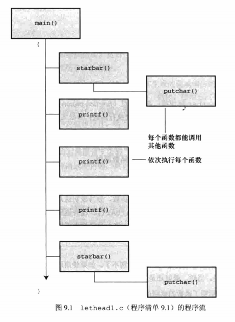	

​		形式参数（形参）：函数定义的函数头中声明的变量。

​		实际参数（实参）：函数调用时，圆括号中的表达式。


​		递归：函数直接或者间接调用自己。每次递归调用时，函数中的局部变量都是私有的，即每次调用时的变量都是独立互不影响的。


### 多文件

```c++
#include <stdio.h>

/*
	<>：引用的是编译器的类库路径里面的头文件。
	""：引用的是你程序目录的相对路径中的头文件。
*/
#include "test.h"
int main()
{
    starbar();
    printf("%s\n",NAME);
    printf("%s\n",ADDRESS);
    printf("%s\n",PLACE);
    starbar();

    return 0;
}
```

```c++
#ifndef TEST_H_INCLUDED
#define TEST_H_INCLUDED

#define NAME "GIGATHINK,INC."
#define ADDRESS "101 Megabuck Plaza"
#define PLACE "Megapolis,CA 94904"

#define WIDTH 40


#endif // TEST_H_INCLUDED
void starbar_n(int n);
void starbar();
```

```c++
#include <stdio.h>
#include <test.h>
void starbar_n(int n)
{
    int count;
    for(count = 0 ; count < n ; count++)
    {
        putchar('*');
    }
    putchar('\n');
}

void starbar()
{
    int count;
    for(count = 0 ; count < WIDTH ; count++)
    {
        putchar('*');
    }
    putchar('\n');
}
```


## 指针

​		指针：用于存储变量的地址。即，值为内存地址的变量。


​		scanf 函数的参数列表中，类型转换说明之后就是以地址作为参数。


```c++
/*
	首先声明一个 int 类型的变量并赋初始值 100。
	然后声明一个 int 类型的指针变量（int* ptr），然后将 变量 a 在内存中的地址赋值给 ptr。
	
	int* ptr：声明一个指向 int 类型变量的指针，即该指针只能指向 int 类型的变量。
	&a：取出变量 a 在内存中的地址，通常为一个十六进制的数。
		
*/
int a = 100;

//此时 ptr 中存储就是 a 变量在内存中的地址，虽然是一个十六进制数，但是该变量并不能参与算术运算
int* ptr = &a;
```


"&"：取出给定变量的存储地址。即 pooh 是变量名， &pooh 就是变量的地址。地址即变量在内存中的位置。"%p" 转换说明可以打印出给定变量的地址。


​		"*"：

​				1、当出现在变量之前时，作用是取出存储在指针变量中的值。

​				2、如果出现在数据类型之后，作用是声明一个对应类型的指针变量。声明后，该变量就只能指向其声明		类型的变量的地址。


```c++
#include <stdio.h>

int main()
{
    int a = 100;
    // int* b：声明一个 int 类型的指针变量。
    // &a：变量 a 的内存地址。
    int* b = &a;
    
    //"%p"：打印变量的内存地址，通常是十六进制
    printf("%d %p\n",a,&a);
    
    // "*b"：此时的作用是取出指针变量 b 指向的内存中存储的值，即 a 变量的值：100
    printf("%d\n",*b);
    return 0;
}
```


```c++
#include <stdio.h>
int interchange(int a,int b);
int interchanges(int* a,int* b);
int main()
{
    int a= 3;
    int b= 4;

    interchange(a,b);
    printf("%d\t%d\n",a,b);

    interchanges(&a,&b);
    printf("%d\t%d\n",a,b);

    return 0;
}
//此时传入该函数的两个变量，与 main 函数中的变量是互相独立的，即在该函数中对参数做的所有操作，并不会对 main 函数中的实参起作用。
int interchange(int a,int b)
{
    int temp = a;
    a = b;
    b = a;
}

//此时，由于参数为指针变量，即形参和实参指向的地址都是相同的，所以在该函数中对形参的内存中存储的值的修改与对 main 函数中的实参起作用。
int interchanges(int* a,int* b)
{
    int temp = *a;
    *a = *b;
    *b = temp;
}
```

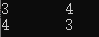

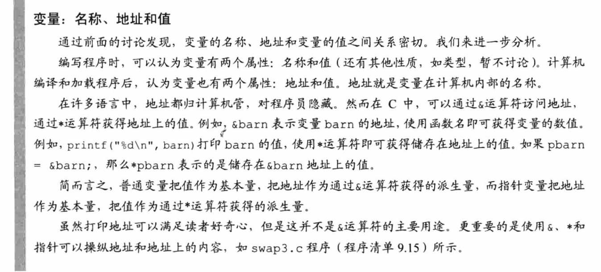


## 数组

​		数组由数据类型相同的一系列元素组成。需要使用数组时，通过声明数组告诉编译器数组中内含多少元素和这些元素的类型。编译器根据这些信息正确地创建数组，普通变量可以使用的类型，数组元素都可以用。并且这些元素在内存中以线性排列。

```c++
// 声明内含20个 int 类型元素的数组
int arr[20];
```

​		要访问数组中的元素，通过使用数组下标索引表示数组中的各元素。数组下标索引从 0 开始。即下标的范围为：0 ~ 数组长度 - 1。

​		arr：数组名，表示数组的起始地址，也表示数组第一个元素的地址。


​		初始化：

​				1、

```c++
int arr[4] = {1,2,3,4};
```

​						使用数组前，必须先初始化 它。并且初始化列表的项数应与数组的大小一致。如果不一致，缺少的				项将被初始化为 0。如果初始化列表的项数大于数组的大小，将产生编译错误。

​				2、

```c++
int arr[] = {1,2,3,4};
```

​						此时省略了声明数组时方括号中的数字，编译器会根据初始化列表中的项数来确定数组的大小。

​		计算数组的大小：

```c++
int arr[] = {1,2,3,4};
int size = sizeof(arr) / sizeof(arr[0])
```


​		C 语言不允许把数组作为一个单元赋给另一个数组，除初始化以外也不允许使用花括号列表的形式赋值。

```c++
int arr[] = {1,2,3,4};
int arrs[];
arrs = arr;   // 不允许此操作
```


​		二维数组：数组中的元素是另外一个数组。

```c++
int arr[5][6];     //声明一个内含 5 个数组元素的数组，每个数组元素内含 6 个 int 类型的元素。

/*访问

	arr[0][0]：二维数组第一个元素
	arr[4][5]：二维数组最后一个元素
*/
```

​				上述的声明，可以当成声明了一个 5 行 6 列的二维表格，每个表格里的元素是 int 类型。但实际它们在		内存中的地址是相邻的。

​		初始化：

```c++
int arr[3][4] = {
    {1,2,3,4},
    {5,6,7,8},
    {9,10,11,12}
};
```

​					也可以省略内部的花括号，此时会按照顺序来初始化数组中的元素。


​		数组与指针的关系：

```c++
#include <stdio.h>
#define SIZE 4

int main()
{
    short dates[SIZE];
    short* pti;
    short index;
    double bills[SIZE];
    double * ptf;

    pti = dates;
    ptf = bills;

    printf("%23s %15s\n","short","double");
    for(index = 0 ; index < SIZE ; index++)
    {
        printf("pointers + %d: %10p %10p\n",index,pti + index, ptf + index);
    }
    return 0;
}
```

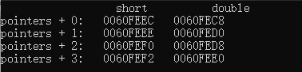

​		pti + index：指针加一，并不是将指针所存储的十六进制数值加一，而是向后移动一个存储单元，即递增它所指向类型的大小，在这里即是，数组下一个元素的地址。这是也为什么声明指针时需要指定类型的原因。

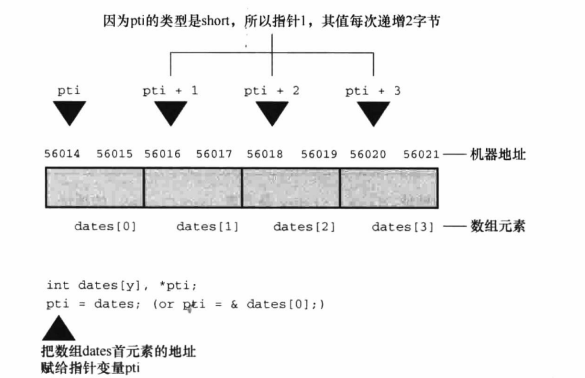

```c++
dates + 2 == &dates[2];   //相同的地址
*(dates + 2) == dates[2];  //相同的值

*dates + 2 //相当于 (*dates) + 2，即取出数组第一个元素的值，再加 2
```

