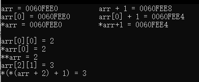
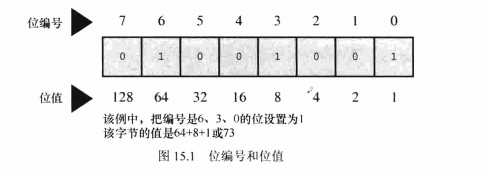

		编译器：把高级语言程序翻译成计算机能理解的机器语言指令集的程序。


​		C语言的文件后缀名为 ".c"，C++的后缀名为 ".cpp"。

​		C变成的基本策略：用程序将源代码文件转换为可执行文件（其中包含可直接运行的机器语言代码）。典型的C实现通过编译和链接两个步骤来完成这一过程。编译器把源代码转换成中间代码，链接器把中间代码和其他代码合并，生成可执行文件。链接器还将源代码和预编译的库代码合并。

​		把源代码转换为机器语言代码，并把结果放在目标代码文件中。虽然目标文件中包含机器语言代码，但是并不能直接运行该文件。因为目标文件中存储的是编译器翻译的源代码，这还不是一个完整的程序。

​				1、目标代码文件确实启动代码，启动代码充当着程序和操作系统之间的接口。

​				2、目标代码还缺少库函数，几乎所有的C程序都要使用C标准库中的函数。目标代码中并不包括该函数的		代码。

​		链接器：将编写的源代码文件，系统的标准启动代码和库代码3部分合并成一个文件，即可执行文件。对于库代码，链接器只会把程序中要用到的库函数代码提取出来。


​		目标代码处理过程：C编译器会创建一个与源代码基本名相同的目标代码文件，其扩展名为 ".o"。一旦链接器生成了完整的可执行程序，就会将其删除。

​		通常，编译器生成的中间目标代码文件的扩展名为 ".obj"。在完成编译之后通常不会删除这些中间文件 。


​		声明：将标识符与计算机内存中的特定位置联系起来，同时也确定了存储在某 位置的信息类型和数据类型。

​		粗体是C90标准新增的关键字，斜体表示C99标准新增的关键字，粗斜体表示是C11标准新增的关键字。


## 数据类型


​		 _ Bool类型表示布尔值， _ complex和_Imaginary分别表示复数和虚数。

​	

​		位：最小的存储单元（bit），可以存储0和1。

​		字节：常用的计算机存储单位，1字节均为8位。字节的标准定义。

​		字：设计计算机时给定的自然存储单位，对于8位的微型计算机1个字长只有8位。

### 整数类型

​		int类型是有符号整型，必须是整数。类型大小一般为4个字节（即一个机器字长），取值范围大致为：-2^31~2^31 - 1。


​		不同进制表示：

​				十六进制：0x或者0X为前缀。

​				八进制：0为前缀。

​		不同进制打印：

​				%d：十进制。

​				%o：八进制。

​				%x：十六进制。

​		如要显示进制前缀则用对应的%#d，%#o，%#x。显示转换时后缀只能小写。即：%ld，%lo，%lx。


​		3个附属关键字修饰基本整数类型：short，long，unsigned。

​				short  int类型（简写为 short）：占用的存储空间可能比int类型少，常用于较小数值的场合以节省空		间。与 int 类似，short是有符号整型

​				long  int 或 long占用的存储空间可能比int多，适合与较大数值的场合。与int类似，long是有符号类型。

​				long  long  int 或long  long（C99标准加入）：占用的存储空间可能比long多，适用于更大数值的场		合，该类型至少占8个字节，与int类似，long  long是有符号类型。

​				unsigned int 或 unsigned：只用于非负值的场合，这种类型与有符号类型表示的范围不同。

​				C90标准中：添加了 unsigned  long  int或unsigned  long ，unsigned  int或unsigned  short类型。

​				C99标准中：添加了 unsigned  long  long  int或unsigned  long  long。

​				在任何有符号类型前面添加关键字  signed，可强调使用有符号类型的意图。

​		C语言只规定可 short占用的内存不能多于 int，long 占用的内存不能少于 int。是为了适应不同的机器。

​		在较小的 int 的字面常量后面加上 l（小写的L）或者 L ，此时，字面常量的类型将变为 long。

​				long  long ：ll 或者 LL。

​				unsigned  long  long：u  或者 U。

​		不同类型的转换字符：

​				unsigned  int：%u。

​				unsigned  long：%lu。

​				unsigned  long  long：%llu。


​				short  int（short）：%hd。

​				十六进制  short：%hx。

​				八进制 short：%ho。


​				long  int（long）：%ld。

​				十六进制 long：%lx。

​				八进制 long：%lo。


​				long  long ：%lld。

### 字符类型

​		char类型用于存储字符，占一个字节。从技术层面看，char是整数类型，因为char类型实际上存储的是整数而不是字符。计算机使用特定的整数来表示特定的字符。

​		字符常量：用单引号括起的单个字符。

​		给 char 类型变量赋值：既可以用字符常量，也可以用字符常量对应的整数。

​		如果用单引号括起多个字符给 char 类型变量赋值，那么变量存储的是最后一个字符的值。

​		**转义字符**：使用特殊的符号序列表示一些特殊的字符。将转义字符赋值给字符类型时，必须用单引号括起来。


​		数字与数字字符的区别：

​				4：数值

​				'4'：数字字符

​		打印字符：%c。

### _Bool类型

​		C99标准新加了：_Bool类型，用于表示布尔值，即逻辑值 true和false。但因为C语言用**非0表示true（打印true为 1），0表示false（打印false为0）**，所以 _Bool类型实际也是一种整数类型。占 1位（即1个比特位）。

### 浮点数类型

​		float：4个字节，有效位数6，即至少能精确表示小数点后6位。打印：%f。

​		double:：8个字节，有效位数13，即至少能精确表示小数点后13位。打印：%f。

​		使用指数表示法表示浮点型常量：可以没有小数部分和指数部分，但同时省略两者；可以省略小数部分或整数部分，但不能同时省略两者。默认情况：浮点型常量为 double 类型。表示 float类型的浮点型常量，可以在常量后面加上 f 或 F。

​		用指数表示法打印：%e。

### 类型大小

​		sizeof 运算符，转换说明：%zd。


​		把一个类型的数据初始化给不同类型的变量时，编译器会把值装换成与变量匹配的类型，这将导致数据丢失。

​		printf和scanf函数用第一个参数表明后续有多少个参数，即第一个字符串中的转换说明与后面的参数一一对应。

## 输出

​		最初，printf语句把输出发送到一个叫做缓冲区的中间存储区域，然后缓冲区中的内容再不断地被发送到屏幕上。C标准明确规定了可是把缓冲区的内容发送到屏幕：当缓冲区满，遇到换行字符或者需要输入的时候。将数据从缓冲区发送到屏幕或文件的行为称为：刷新缓冲区。

​		另一种刷新缓冲区的方法：fflush()函数。

## 字符串和格式化输入/输出

### 字符串

```c++
#include <stdio.h>
#include <string.h>

#define DENSITY 62.4

int main()
{
    float weight,volume;
    int size_of,letters;
    char name[40];  //最多输入39个字符，最后一个字符为字符串结束字符'\0'
    printf("hi! what`s your first name?\n");
    
    //%s：字符串的输入输出格式，scanf的第二个参数是一个地址引用，因为数组名本身就是一个引用，所以不用加&符号，在存储时，存入数组的字符的数量是字符串长度+1，最后一个为“\0”，表示字符串结束符，所以字符串的最大长度应是数组长度-1
    scanf("%s",name);
    printf("%s,what`s your weight in pounds?\n",name);
    scanf("%f",&weight);
    size_of = sizeof name;
    
    //strlen函数在string.h头文件中，用于返回字符串的长度而不是存储字符串的数组的长度
    letters = strlen(name);	
    volume = weight / DENSITY;
    
    //%s表示要打印一个字符串
    printf("well,%s,your volume is %2.2f cubic feet.\n",name,volume);

    printf("also,your first name has %d letters,\n",letters);

    printf("and we have %d bytes to store it.\n",size_of);


    return 0;
}
```

​		sizeof ：以字节为单位返回变量的大小，函数后面的圆括号的使用时机取决于运算对象是类型还是特定量，运算对象是类型时，圆括号必不可少，但对于特定量，可有可无。但就算如此，还是建议所有情况下都使用圆括号。

​		C语言没有专门用于存储字符串的变量类型，字符串都被存储在char类型的数组中。


​		末尾的字符'\0'，是空字符，C语言用它标记字符串的结束。

​		**数组：同类型数据元素的有序序列。**


​		scanf("%s",name)：在读取输入时，会在读取的字符串最后自动加上'\0'。

​		

​	'x' 与 "x" 的区别：

​			'x'：基本类型。

​			"x"：字符数组类型，有两个字符 'x' 和 '\0' 两个字符组成。

​	

```c++
#include <stdio.h>
#include <string.h>

#define  PARISE "You are an extraordinary being."

int main()
{
    char name[40];

    printf("What`s your name? ");
    scanf("%s",name);

    printf("Hello,%s. %s\n",name,PARISE);

    printf("Your name of %zd letters occupies %zd memory cells.\n",strlen(name),sizeof(name));

    printf("The phrase of praise has %zd letters ",strlen(PARISE));

    printf("and occupies %zd memory cells.\n",sizeof(PARISE));

    return 0;
}
```


### 预编译（编译时替换）

​		格式：#define  NAME  value

​		**末尾没有分号，NAME 和 value中间也没有 = 符号**

​		

​		#define  PI  3.1415 ：编译时程序中所有的 PI 都会被替换成 3.1415。


​		**const关键字：限定变量为只读。**一旦定义后，程序中可以打印，可以使用，但是不能修改。

### 明示常量


​		请求printf()函数打印数据的指令要与待打印数据的类型相匹配，这些符号被称为转换说明。它们制定了如何把数据转换成可现实的形式。

​		printf() 函数格式：

​				printf(格式化字符串，打印项1，打印项2...)

​						打印项1，打印项2...：要打印的项，可以是变量，常量，甚至可以是在打印之前要计算的表达式。				而格式化字符串中应包含每个待打印项对应的转换说明。


### 转换说明


​		

​		**参数传递机制：**


​		printf()：返回值是打印的字符的个数，如果有输出错误，则返回一个负值。

​	


​		scanf()：将输入的字符串转换成整数，浮点数，字符或字符串。与printf类似，也需要使用格式化字符串和参数列表。其中格式化字符串表明字符输入流的目标数据类型。

​		与printf主要的区别：在于参数列表。

​				printf：使用变量，常量和表达式

​				scanf：使用指向变量的指针，即如果读取基本的值，变量前需加上 "&" 符号，如果是数组等其他类型，		不要加此符号。

​		scanf：使用空白符号将输入分成多个字段。在依次把转换说明和字段匹配时跳过空白。但是使用 "%c" 作为转换说明时，并不会跳过空白字符，而是将其作为一个字符读入。


​		printf 打印 float，double 类型时都使用可以转换说明 "%f，%e,，%E，%g，%G"；而对于scanf函数，它们只用于 float 类型，double 类型需要使用修饰符 "l"。


​		修饰符：


​		

​		以 "%d" 转换说明读取一个整数：scanf 函数每次读取一个字符，跳过所有的空白字符，直至遇到第一个非空白字符才开始读取。因为要读取整数，所以 scanf 函数希望发现一个数字字符或者一个 ( - 或 + ) 字符。如果找到一个数字或符号，它便保存该字符，并读取下一个字符。如果下一个字符是数字，它便保存该数字 并读取下一个字符。不断读取和保存字符，直至遇到非数字字符。如果遇到一个非数字字符，便认为读到了整数末尾，然后，scanf 函数把非数字字符返回输入，这意味着程序在下一次读取输入时，首先读取到的是上一次读取丢弃的非数字字符。最后，scanf 计算以读取数字相应的数值，并将计算后的值放入指定的变量中。

​		如果使用字段宽度，scanf 函数会在字段结尾或第一个空白字符处停止读取。

​		如果第一非空白字符不是数字，那么 scanf 将停在哪里，并将其放回输入中，不会把值赋给指定变量。程序在下一次读取输入时，首先读到的还是这个非数字字符。如果 scanf 带多个转换说明，将在第一个出错处停止读取输入。


​		scanf  允许把普通字符放在格式化字符串中，除空格字符外的普通字符必须与输入字符串严格匹配。


​		scanf("%c",&m)与scanf("  %c",&m)的区别：前者从输入的第一个字符开始读，后者会跳过最开始的空格，从第一个非空字符开始读。


​		scanf 返回成功读取的项数。没有读取任何项，将返回0。


"*" 在 printf 和 scanf 中的区别：

​		printf：如果不想预先指定字段宽度，而是通过程序执行，可以用 * 修饰符代替字段宽度，但还是要用参数告诉函数，字段宽度是多少。

```c
printf("%*d",width,result); //width:为字段宽度，result：真正要打印的值
```

​		scanf ：把 * 放在转换说明之间，scanf 会跳过相应的输入项。

```c
scanf("%*d %*d %d",&n); //如果输入：55 32 20 ，最后 n 的值为20
```


## 运算符，表达式和语句

​		"="：赋值运算符，左侧必须引用一个存储一个位置，通常是一个变量。

​		"/"：除法运算，浮点数除以浮点数是浮点数；整数除以整数是整数，即丢弃小数部分，**不是四舍五入**。整数除以浮点数，或者浮点数除以整数，结果是浮点数。

​		"%"：求模运算，只能用于两个整数取模的运算，如果其中有一个是负数，那么如果负数在前，结果为负数，如果正数在前，结果为正数。即 a%b = a - (a / b) * b

​		递增运算符和递减运算符（--，++）：优先级仅次于括号。

​		每一个表达式都有返回值，赋值表达式的值与赋值运算符左侧变量的值相同。

### 类型转换：

​		1、当类型转换出现在表达式中，无论是unsigned还是signed的char和short都会被自动转换成int。

​		2、设计两种类型的运算，两个值会被分别转换成两种类型的更高级别。

​		3、类型的级别从高到低：long  double，double，float，unsigned long，long long，unsigned long，long，unsigned int，int。short和char会被自动升级为int。

​		4、在赋值表达式语句中，计算的最终结果会被转换成被赋值变量的类型，这个过程可能导致类型升级或降级。

​		5、当作为函数传参数传递时，char和short会被转换成int，float被转换成double。

​		待赋值的值与目标类型不匹配时：

​				1、目标类型是无符号整型，且待赋的值是整数时，额外的位将被忽略。

​				2、如果目标类型是一个有符号整型，且待赋的值是整数，结果因实现而异。

​				3、如果目标类型是一个整型，且待赋的值是浮点数，该行为是未定义的。

​		浮点数转为整数：直接舍弃小数部分。

​		强制类型转换：在某个量的前面放置用圆括号括起来的类型名，该类型名即是希望转换成的目标类型，圆括号和它括起来的类型名构成了强制类型转换运算符。


```c++
#include <stdio.h>

const int S_PER_M = 60;
const int S_PER_H = 3600;
const double M_PER_K = 0.62137;

int main()
{
    double distk,distm;
    double rate;
    int min,sec;
    int time;
    double mtime;
    int mmin,msec;

    printf("this program converts your time for a metric race\n");
    printf("to a time for running a mile and to your average\n");
    printf("speed in miles per hour.\n");

    printf("Please enter,in milometers,the distance run.\n");

    scanf("%lf",&distk);

    printf("next enter the time in minutes and seconds.\n");

    printf("begin by entering the minutes.\n");

    scanf("%d",&min);
    printf("now enter the seconds.\n");
    scanf("%d",&sec);

    time = S_PER_M * min + sec;
    distm = M_PER_K * distk;

    rate = distm / time * S_PER_H;

    mtime = (double)time * distm;

    mmin = (int)mtime / S_PER_M;

    msec = (int)mtime % S_PER_M;

    printf("you ran %1.2f km (%1.2f miles) in %d min,%d sec.\n",distk,distm,min,sec);

    printf("that pace corresponds to running a mile in %d min, ",mmin);

    printf("%d sec.\nyour average speed was %1.2f mph.\n",msec,rate);

    return 0;
}
```

## 循环

​		创建一个循环中涉及三个行为：

​				1、必须初始化计数器

​				2、计数器要与有限的值作比较

​				3、每次循环是更新计数器。

​		while：

```c++
while( 条件表达式 )
{
    循环体
}

/**
当条件表达式为真（或者一个非零值或变量），则执行循环体，然后继续判断条件表达式，周而复始，直到条件表达式为假（或者一个等于零的值或变量），才退出循环。执行循环后的语句

上述的三个行为：
初始化必须在while循环之前
比较则是while循环中的条件表达式
更新计数器则在循环体内部

**/

int count = 1;

while(count < 5)
{
    count++;
}
```

​		在构建while循环时，必须让测试表达式的值有变化，表达式最终要为假。否则会陷入死循环。并且只有在对测试条件求值时，才决定时终止还是继续循环。

​		**只有在测试条件后面的单独语句或者用花括号括起来复合语句的才是循环部分，并且条件表达式的括号后面没有分号**。

​		关系表达式只有两个返回值：真（1），假（0）。

​		当用数字字面量或者变量作为条件表达式时，非0为真，0为假。

​		当使用形如：count == 5，这样的条件表达式时，如果把 == 错写为 = ，那么将导致死循环，好的做法是，将数字字面量写在比较运算符前面，即：5 == count。


​		for：

```c++
for(表达式1 ; 表达式2 ; 表达式3)
{
    循环体
}

/*
表达式1：对应计数器的初始化，可以省略，省略后，计数器的初始化必须在for循环之前，此表达式只会在循环开始之前执行一次
表达式2：对应比较，即应该是一个关系表达式，省略后，默认真（1），在循环开始前执行，每次循环结束后，会再次执行
表达式3：一般为计数器的更新，省略后，必须在循环体内部更新计数器，执行完循环体后执行此表达式，完成后，才是一次完整的循环。

两个分号不能省略

*/


for(int i = 0 ; i < 100 ; i++)
{
    printf("ffff");
}
```

​		逗号运算符：

​				1、它保证了被它分隔的表达式从左到右求值。

​				2、整个逗号表达式的值是右侧表达式的值。

​		do  while：

```c++
do
{
    循环体
}
while(条件表达式);

/*
	在条件表达式的括号后，以分号结尾
*/
```

​		do  while也被称为出口条件循环，即先执行执行循环体，在判断循环条件。所以其特征是循环至少执行一次。

### 数组

​		数组是按顺序存储的一系列类型相同的值，整个数组有一个数组名，通过整数下标访问数组中单独的项或元素。数组的下标从0开始。

```c++
int arr[20];
/*
	声明一个含20个整型元素的数组，可以访问的下标为0~19。
*/
```

## 分支和跳转

​		getchar()：从输入队列中返回下一个字符。

​		putchar()：打印给它传递的字符参数。

​		它们不要转换说明，只处理字符数据。

​		ctype.h 头文件中包含一些专门处理字符的函数，这些函数接受一个字符作为参数，如果该字符属于某特殊的类别，就返回一个非零值；否则，返回0。


​			字符映射函数不会修改原始的参数，这些函数只会返回已修改的值。

```c++
#include <stdio.h>
#include <ctype.h>

int main()
{
    char ch;

    while((ch = getchar()) != '\n')
    {
        if(isalpha(ch))
        {

            putchar(ch + 1);
        }
        else
        {

            putchar(ch);
        }
    }
    putchar(ch);

    return 0;
}
```

​	

​		if  else if：

```c++
#include <stdio.h>
#define PATE1 0.13230
#define PATE2 0.15040
#define PATE3 0.30025
#define PATE4 0.34025
#define BREAK1 360.0
#define BREAK2 468.0
#define BREAK3 720.0
#define BASE1 (PATE1 * BREAK1)
#define BASE2 (BASE1 + (PATE2 * (BREAK2 - BREAK1)))
#define BASE3 (BASE1 + BASE2 + (PATE3 * (BREAK3 - BREAK2)))
int main()
{
    double kwh;
    double bill;
    printf("please enter the kwh used.\n");
    scanf("%lf",&kwh);
    if(kwh <= BREAK1)
    {
        bill = PATE1 * kwh;
    }
    else if(kwh <= BREAK2)
    {
        bill = BASE1 + (PATE2 * (kwh - BREAK1));
    }
    else if(kwh <= BREAK3)
    {
        bill = BASE2 + (PATE3 * (kwh - BREAK2));
    }
    else
    {
        bill = BASE3 + (PATE4 * (kwh - BREAK3));
    }
    printf("the charge for %.1f kwh is %1.2f.\n",kwh,bill);
    return 0;
}
```

​		如果没有花括号，else 与离它最近的 if 匹配，除非最近的 if 被花括号括起来。


逻辑运算符


​		&&，||：双目运算符。

​		!：单目运算符。


​		test1 && test2：当  test1 与 test2 都为真时，test1 && test2 为真。并且，如果 test1 为假，则直接返回假，test2 并不会执行。

​		test1 || test2：当  test1 与 test2 都为假时，test1 || test2 为假。并且，如果 test1 为真，则直接返回真，test2 并不会执行。

​		!test：如果 test 为真，!test 为假；如果 test 为假，!test 为真。

​		引入 iso646.h 头文件，可以用 and 替换 &&，or 替换 ||，not 替换 !。

```c++
#include <stdio.h>
#include <iso646.h>
#define end '.'

int main()
{
    int count = 0;
    char ch;
    while((ch = getchar()) != end)
    {
        //if(ch != '"' && ch != '\'')
        if(ch != '"' and ch != '\'')
        {
            count++;
        }
    }
    printf("%d",count);
    return 0;
}

/*
	判断非空字符：引入 ctype.h 头文件，使用 isspace 函数，参数为一个字符类型的值。
*/
```


​		三目运算符： test ? x : y

​				如果 test 为真，则返回 x 的值，否则返回 y 的值。


​		continue：跳过本次循环剩余的部分，开始下一轮循环。对于 while 和 do while 来说就是执行决定是否继续循环的条件表达式，对于 for 来说就是执行更新计数器的表达式，即表达式3。


​		break：终止循环。即立即到循环后的语句继续执行。并且只会影响包含它的当前循环。


​		switch：

```c++
switch(n)
{
 	case x:
		表达式;
		break;
	case x:
		表达式;
		break;
	case x:
		表达式;
		break;
    ...
    //default 语句是可选的
    default:
        表达式;
        break;
}
```

​		先对 switch 后圆括号的表达式求值，然后扫描标签，即 case 后面的值，直到发现一个匹配的值为止，然后执行对应标签内的语句，遇到 break 就跳出 switch 模块。由此可以看出圆括号中的表达式的值应该是一个准确值，并且是一个整数类型的值，所以 case 后的标签也应是一个整数类型的值。如果没有匹配到对应的标签，此时：如果有 defautl，则执行 default 内的语句，如果没有则跳出 switch 模块。

​		break 语句必不可少，如果没有 break 语句，则匹配到对应的标签后，执行完其对应的语句后，会继续执行紧挨其后的 case 中的语句，直到碰到 break 语句或者 switch 块末尾。并且匹配的顺序是先 case，再 default，就算 default 写在模块开头也是如此。


​		goto：由两部分组成，goto 和标签名，表签名遵守命名规范。最好不要使用。

```c++
#include <stdio.h>
int main()
{
    printf("first\n");
    //程序会直接跳转到以 threed: 开头的语句继续执行
    goto threed;
    
    printf("second\n");
    
    threed:printf("threed\n");
    
    return 0;
}
```

## 字符输入/输出和输入验证

​		在进行输入操作时，大部分系统在用户按下 enter 键之前不会重复打印刚输入的字符，这种形式输入缓冲输入。用户输入的字符被手机并存储在一个被称为缓冲区的临时存储区中，按下 enter 键后，程序才可使用用户输入的字符。


​		其作用：

​				1、将若干字符作为一个块进行传输比逐个发送这些字符节约时间。

​				2、如果打错字符，可以直接通过键盘修正错误。

​				当最后按下 enter 键时，传输的是正确的输入。

​		两类缓冲：

​				完全缓冲 I/O ：指的是当缓冲区被填满时才刷新缓冲区（内容被发送至目的地），通常出现在文件输入		中。缓冲区的大小取决于系统。

​				行缓冲 I/O：指的是在出现换行符时刷新缓冲区，键盘输入通常是行缓冲输入，所以在按下 enter 键后才		刷新缓冲区。

​		C 规定：输入是缓冲的。但某些 C 还是提供了无缓冲输入的选项，为其提供了一系列特殊的函数。原型在 conio.h 头文件中。这些函数包括用于回显无缓冲输入的 getche() 函数和用于无回显无缓冲输入的 getch() （回显输入意味着用户输入的字符直接显示在屏幕上，无回显输入意味着击键后对应的字符不显示）。


​		C语言中，用 getchar() 读取文件检测到文件结尾时将返回一个特殊的值，即EOF。 scanf 函数检测到文件结尾时也返回EOF。通常EOF定义在 stdio.h 头文件中。通常为：-1。


​		**不能将 scanf 和 getchar 混用**：

```c++
#include <stdio.h>
void display(char ch,int row,int line)
{
    for(int i = 0 ; i < row ; i++)
    {
        for(int j = 0 ; j < line ; j++)
        {
            putchar(ch);
        }
        putchar('\n');
    }
}
int main()
{
    int ch;
    int lines,rows;
    while((ch = getchar()) != '\n')
    {
        scanf("%d %d",&rows,&lines);
        if(lines > 0 && rows > 0)
        {
            display(ch,rows,lines);
        }
        /*
            没有这个循环，程序在输入第一行数据 按下回车后，程序将终止。
            原因是：当按下回车后，回车也会作为一个字符被发送给程序，然后回到 第一个 while循环处，由于赋值给 ch 的是回车字符，所以程序会判断为假，不继续执行循环
        */
        while(getchar() != '\n')
        {
            continue;
        }
    }
    return 0;
}
```


## 函数

​		函数是完成特定任务的独立程序代码单元

```c++
#include <stdio.h>
#define NAME "GIGATHINK,INC."
#define ADDRESS "101 Megabuck Plaza"
#define PLACE "Megapolis,CA 94904"
#define WIDTH 40

//函数原型：告诉编译器函数的类型
void starbar();
int starbar_n(int n);

int main()
{
    //调用函数：在此处执行函数
    starbar();
    printf("%s\n",NAME);
    printf("%s\n",ADDRESS);
    printf("%s\n",PLACE);
    starbar();

    return 0;
}

//函数定义：明确指定函数要干什么
//starbar：函数名；函数名后的括号内，指定调用函数时需要传递的参数个数及其对应的类型，其被称为形参，并且声明参数时，一个参数对应对应一个数据类型；没有参数时，圆括号不能省略
//void：返回值类型，如果没有返回值:void，不能省略。有返回值，则是对应返回值的类型，并且，函数一定要执行 return 语句。
void starbar()
{
    int count;
    for(count = 0 ; count < WIDTH ; count++)
    {
        putchar('*');
    }
    putchar('\n');
}
int starbar_n(int n)
{
    int count;
    for(count = 0 ; count < n ; count++)
    {
        putchar('*');
    }
    putchar('\n');
    //用于将函数运算的结果，返回给调用函数，值的类型必须与定义函数时声明的类型一致，或者可以隐式转换
    return 0;
}

```

​		如果将函数定义放在调用的函数之前，那么就不需要函数原型。

​		函数签名：由返回值，函数名以及参数列表组成。

	

​		形式参数（形参）：函数定义的函数头中声明的变量。

​		实际参数（实参）：函数调用时，圆括号中的表达式。


​		递归：函数直接或者间接调用自己。每次递归调用时，函数中的局部变量都是私有的，即每次调用时的变量都是独立互不影响的。


### 多文件

```c++
#include <stdio.h>

/*
	<>：引用的是编译器的类库路径里面的头文件。
	""：引用的是你程序目录的相对路径中的头文件。
*/
#include "test.h"
int main()
{
    starbar();
    printf("%s\n",NAME);
    printf("%s\n",ADDRESS);
    printf("%s\n",PLACE);
    starbar();

    return 0;
}
```

```c++
#ifndef TEST_H_INCLUDED
#define TEST_H_INCLUDED

#define NAME "GIGATHINK,INC."
#define ADDRESS "101 Megabuck Plaza"
#define PLACE "Megapolis,CA 94904"

#define WIDTH 40


#endif // TEST_H_INCLUDED
void starbar_n(int n);
void starbar();
```

```c++
#include <stdio.h>
#include <test.h>
void starbar_n(int n)
{
    int count;
    for(count = 0 ; count < n ; count++)
    {
        putchar('*');
    }
    putchar('\n');
}

void starbar()
{
    int count;
    for(count = 0 ; count < WIDTH ; count++)
    {
        putchar('*');
    }
    putchar('\n');
}
```


## 指针

​		指针：用于存储变量的地址。即，值为内存地址的变量。


​		scanf 函数的参数列表中，类型转换说明之后就是以地址作为参数。


```c++
/*
	首先声明一个 int 类型的变量并赋初始值 100。
	然后声明一个 int 类型的指针变量（int* ptr），然后将 变量 a 在内存中的地址赋值给 ptr。
	
	int* ptr：声明一个指向 int 类型变量的指针，即该指针只能指向 int 类型的变量。
	&a：取出变量 a 在内存中的地址，通常为一个十六进制的数。
		
*/
int a = 100;

//此时 ptr 中存储就是 a 变量在内存中的地址，虽然是一个十六进制数，但是该变量并不能参与算术运算
int* ptr = &a;
```


"&"：取出给定变量的存储地址。即 pooh 是变量名， &pooh 就是变量的地址。地址即变量在内存中的位置。"%p" 转换说明可以打印出给定变量的地址。


​		"*"：

​				1、当出现在变量之前时，作用是取出存储在指针变量中的值。

​				2、如果出现在数据类型之后，作用是声明一个对应类型的指针变量。声明后，该变量就只能指向其声明		类型的变量的地址。


```c++
#include <stdio.h>

int main()
{
    int a = 100;
    // int* b：声明一个 int 类型的指针变量。
    // &a：变量 a 的内存地址。
    int* b = &a;
    
    //"%p"：打印变量的内存地址，通常是十六进制
    printf("%d %p\n",a,&a);
    
    // "*b"：此时的作用是取出指针变量 b 指向的内存中存储的值，即 a 变量的值：100
    printf("%d\n",*b);
    return 0;
}
```


```c++
#include <stdio.h>
int interchange(int a,int b);
int interchanges(int* a,int* b);
int main()
{
    int a= 3;
    int b= 4;

    interchange(a,b);
    printf("%d\t%d\n",a,b);

    interchanges(&a,&b);
    printf("%d\t%d\n",a,b);

    return 0;
}
//此时传入该函数的两个变量，与 main 函数中的变量是互相独立的，即在该函数中对参数做的所有操作，并不会对 main 函数中的实参起作用。
int interchange(int a,int b)
{
    int temp = a;
    a = b;
    b = a;
}

//此时，由于参数为指针变量，即形参和实参指向的地址都是相同的，所以在该函数中对形参的内存中存储的值的修改与对 main 函数中的实参起作用。
int interchanges(int* a,int* b)
{
    int temp = *a;
    *a = *b;
    *b = temp;
}
```


## 数组

​		数组由数据类型相同的一系列元素组成。需要使用数组时，通过声明数组告诉编译器数组中内含多少元素和这些元素的类型。编译器根据这些信息正确地创建数组，普通变量可以使用的类型，数组元素都可以用。并且这些元素在内存中以线性排列。

```c++
// 声明内含20个 int 类型元素的数组
int arr[20];
```

​		要访问数组中的元素，通过使用数组下标索引表示数组中的各元素。数组下标索引从 0 开始。即下标的范围为：0 ~ 数组长度 - 1。

​		arr：数组名，表示数组的起始地址，也表示数组第一个元素的地址。


​		初始化：

​				1、

```c++
int arr[4] = {1,2,3,4};
```

​						使用数组前，必须先初始化 它。并且初始化列表的项数应与数组的大小一致。如果不一致，缺少的				项将被初始化为 0。如果初始化列表的项数大于数组的大小，将产生编译错误。

​				2、

```c++
int arr[] = {1,2,3,4};
```

​						此时省略了声明数组时方括号中的数字，编译器会根据初始化列表中的项数来确定数组的大小。

​		计算数组的大小：

```c++
int arr[] = {1,2,3,4};
int size = sizeof(arr) / sizeof(arr[0])
```


​		C 语言不允许把数组作为一个单元赋给另一个数组，除初始化以外也不允许使用花括号列表的形式赋值。

```c++
int arr[] = {1,2,3,4};
int arrs[];
arrs = arr;   // 不允许此操作
```


​		二维数组：数组中的元素是另外一个数组。

```c++
int arr[5][6];     //声明一个内含 5 个数组元素的数组，每个数组元素内含 6 个 int 类型的元素。

/*访问

	arr[0][0]：二维数组第一个元素
	arr[4][5]：二维数组最后一个元素
*/
```

​				上述的声明，可以当成声明了一个 5 行 6 列的二维表格，每个表格里的元素是 int 类型。但实际它们在		内存中的地址是相邻的。

​		初始化：

```c++
int arr[3][4] = {
    {1,2,3,4},
    {5,6,7,8},
    {9,10,11,12}
};
```

​					也可以省略内部的花括号，此时会按照顺序来初始化数组中的元素。


​		数组与指针的关系：

```c++
#include <stdio.h>
#define SIZE 4

int main()
{
    short dates[SIZE];
    short* pti;
    short index;
    double bills[SIZE];
    double * ptf;

    pti = dates;
    ptf = bills;

    printf("%23s %15s\n","short","double");
    for(index = 0 ; index < SIZE ; index++)
    {
        printf("pointers + %d: %10p %10p\n",index,pti + index, ptf + index);
    }
    return 0;
}
```


​		pti + index：指针加一，并不是将指针所存储的十六进制数值加一，而是向后移动一个存储单元，即递增它所指向类型的大小，在这里即是，数组下一个元素的地址。这是也为什么声明指针时需要指定类型的原因。


```c++
dates + 2 == &dates[2];   //相同的地址
*(dates + 2) == dates[2];  //相同的值

*dates + 2 //相当于 (*dates) + 2，即取出数组第一个元素的值，再加 2
```


```c++
#include <stdio.h>
int data[2] = {100,200};
int moredata[2] = {300,400};
int main()
{
    int *p1, *p2, *p3;

    p1 = p2 = data;
    p3 = moredata;
    printf("  *p1 = %d,   *p2 = %d,    *p3 = %d\n",*p1,*p2,*p3);
    printf("*p1++ = %d, *++p2 = %d,(*p3)++ = %d\n",*p1++,*++p2,(*p3)++);
    printf("  *p1 = %d,   *p2 = %d,    *p3 = %d\n",*p1,*p2,*p3);
    return 0;
}
```


```c++
#include <stdio.h>
#define SIZE 10
int sump(int *start,int *end)
{
    int total = 0;
    while(start < end)
    {
        total += *start;
        // 如果 start 被声明为 int [] ，那么此表达式不可用
        start++;
    }
    return total;
}

int main()
{
    int marbles[SIZE] = {20,10,5,39,4,16,19,26,31,20};
    long answer;
    // 此时 end 指向的位置是数组最后一个元素的后面，C 保证在给数组分配空间时，指向数组后面的第一个位置的指针仍是有效的指针。
    answer = sump(marbles,marbles + SIZE);
    printf("the total number of marbles is %ld.\n",answer);
    return 0;
}
```

​		

​		由于将数组传递给函数时，传递的是指向数组的指针，由于通过该指针可以修改原始数组的值，所以如果函数的并不修改原始数组的值，那么为了防止出现错误的操作，可以在函数的形参前加上 const 来保证，函数运行期间原始数组的值不变。

```c++
#include <stdio.h>
#define SIZE 10

// 此时，如果函数修改原数组的值，会报错。但此时，并不意味着原数组不可变
int sump(const int *start,int *end)
{
    int total = 0;
    while(start < end)
    {
        total += *start;
        start++;
    }
    return total;
}

int main()
{
    int marbles[SIZE] = {20,10,5,39,4,16,19,26,31,20};
    long answer;
    answer = sump(marbles,marbles + SIZE);
    printf("the total number of marbles is %ld.\n",answer);
    return 0;
}
```

​		被 const 修饰，意味着，该变量只能被初始化一次。并且在声明时就要被初始化。

```c++
#include <stdio.h>
#define SIZE 10
int main()
{
    int arr[SIZE] = {1,2,3,4,5,6,7,8,9,10};
    const int *point_arr = arr;
    
    // 因为 const 修饰，所以该操作不被允许
    (*point_arr)++;
    printf("%d",*point_arr);
    
    // 原数组没有被 const 修饰，允许该操作
    arr[0]++;
    printf("%d",arr[0]);
    return 0;
}
```

​		上面的实例表示，如果原数组没有被 const 修饰，而有一个指针被 const 修饰并指向该数组，那么通过该指针不能修改数组的值（并不是不能修改指针的值，point_arr++，即将指针向后移动至下一个元素起始地址，该操作，还是被允许的），但是通过数组名还是能修改数组中的值。


​		指针赋值和 const 的规则：

​				1、把 const 数据或非 const 数据的地址初始化为指向 const 的指针或为其赋值是合法的。

​				2、只能把非 const 数据的地址赋值给普通指针。

​		不能把 const 数组名作为实参传递给无 const 修饰的指针形参，其如果修改 const 中的数据，结果是未定义的。


```c++
#include <stdio.h>
#define SIZE 10
int main()
{
    int arr[SIZE] = {1,2,3,4,5,6,7,8,9,10};
		
    // 此时，通过指针不能修改指向的地址中的值，但指针指向的地址可以改变。即指针可以指向别处
    const int * point_1 = arr;
    
    // 此时，通过指针能修改指向的地址中的值，但指针指向的地址不能改变，即指针不能指向别处。
    int * const point_2 = arr;
    
    // 此时，通过指针不能修改指向的地址中的值，指针也不能指向别处。
    const int * const point_3 = arr;

    return 0;
}
```


### 指针与二维数组的关系

```c++
	int arr[4][2];
```

​					1、因为 arr 是数组首元素的地址，所以 arr 和 &arr[0] 的值相同，而 arr[0] 本身是一个内含两个整数			的数组，所以，arr[0] 和它的首元素的地址（即 &arr[0] [0] 的值）相同，简而言之，arr[0] 是一个占用一			个 int 大小对象的地址，而 arr 是一个占用两个 int 大小对象的地址。

​					2、给指针或地址加1，其值会增加对应类型大小的数值，由于 arr 与 arr[0] 所指向的对象占用的空间			不同，所以 arr + 1 与 arr[0] + 1 的值不同。

​					3、在指针前使用 * 运算符，或者数组名后使用带下标的 [] 运算符，得到引用对象代表的值。因为 			arr[0] 是数组的首元素的地址（arr[0] [0]），所以 *(arr[0]) 表示存储在 arr[0] [0] 上的值。而 *arr 代表的			是数组 arr[0] 的值，而 arr[0] 本身也是一个地址，所以 *arr 相当于 &arr[0] [0] ，所以如果想通过数组名			获取二维数组中第一个元素的值要使用 **arr。即 arr 是地址的地址，要获取值必须要使用两次 * 运算符。

```c++
#include <stdio.h>
int main()
{
    int arr[4][2] = {{2,4},{6,8},{1,3},{5,7}};
    printf("arr = %p\t\tarr + 1 = %p\n",arr,arr + 1);
    printf("arr[0] = %p\tarr[0] + 1 = %p\n",arr[0],arr[0] + 1);
    printf("*arr = %p\t\t*arr+1 = %p\n",*arr,*arr + 1);
    printf("\narr[0][0] = %d\n",arr[0][0]);
    printf("*arr[0] = %d\n",*arr[0]);
    printf("**arr = %d\n",**arr);
    printf("arr[2][1] = %d\n",arr[2][1]);
    printf("*(*(arr + 2) + 1) = %d\n",*(*(arr + 2) + 1));

    return 0;
}
```



```c++
int (*point)[2];
int *point[2];

// 上面两个声明，由于 [] 的优先级比 * 高，所以：
// 	第一句：point 指向一个内含两个 int 类型值得数组.
// 	第二句：point 是一个内含两个指针元素的数组，即数组的每个元素都是一个指针
```


​		

​		变长数组：

​				在老的 C 语言版本中，数组的长度必须明确指定，即不能用变量来表示数组的长度。

```c++
int size = 10;
int arr[size];    // 老的C语言版本中，不允许该操作。在 C99 标准之后，该操作被允许。
```


## 字符串和字符串函数

​		字符串是以空字符（\0）结束的 char 类型数组。

```c++
#include <stdio.h>
#define MSG "i am a symbolic string constant."
#define MAXLENGTH 81
int main()
{
    // 双引号括起来的内容被称为字符串字面量（字符串常量），当用此种形式定义字符串时，数组的元素个数至少要比字符串长度多 1 （为了容纳空字符），所有未被使用的元素都被自动初始化为 '\0'。如果并不确定数组大小，可以省略声明时中括号中的值，编译器会自动将大小定为字符串长度加 1 。但此种方法只适用于初始化数组时。
    char words[MAXLENGTH] = "i am a string in an array.";
    
    // 用双引号括起来的内容被视为指向该字符串存储位置的指针，此种方式声明时，字符串的值是不可以改变的。就算去掉 const 也是一样。
    const char * pt1 = "something is pointing at me.";
    
    // 显示字符串，并在末尾自动加上换行符
    puts("here are some strings:");
    
    puts(MSG);
    puts(words);
    puts(pt1);
    words[8] = 'p';
    puts(words);

    return 0;
}
```


### 		字符串输入

​						gets：读取整行输入，知道遇到换行符，然后丢弃换行符，存储其余字符。但是其存在缓存溢出的				问题，后来就用 fgets 来替代它。

​						fgets：功能与 gets 一样，但是其通过第二个参数来限制读入的字符数来解决溢出的问题。所以该函				数也专门用于处理文件输入。

​								第 2 个参数指明了读入字符的最大数量，如果该参数的值为 n ，那么 fgets 将读取 n-1 个字						符，或者读到遇到的第一个换行符为止。

​								如果 fgets 读到一个换行符，会把它存储在字符串中，而 gets 会丢弃换行符。

​								fgets 函数的第三个参数指明要读取的文件，如果读入从键盘输入的数据，则以 stdin 作为参数

​						因为 fgets 函数把换行符敷在字符串的末尾，通常要与 fputs函数配合使用

​						fputs：通常与 fgets 配合使用，其第二个参数知名它要写入的文件，如果打印到显示器上，使用 				stdout 作为该参数。此时不会在字符串末尾追加换行符。

```c++
#include <stdio.h>
#define STLEN 14
int main()
{
    char words[STLEN];
    puts("enter a string,please.");
    fgets(words,STLEN,stdin);
    printf("your string twice (puts(), then fputs()):\n");
    puts(words);
    fputs(words,stdout);
    puts("enter another string,please.");
    fgets(words,STLEN,stdin);
    printf("your string twoce (put(),then fputs()):\n");
    puts(words);
    fputs(words,stdout);
    puts("done.");

    return 0;
}
```

​		fputs：返回指向 char 的指针，如果一切进行顺利，该函数返回的地址与传入的第一个参数相同。大事故，如果函数读到文件末尾，它将返回一个特殊的指针：空指针。该指针保证不会指向有效的数据，所以可用于标识这种特殊情况。

### 字符串输出

​		put：传递需要打印的字符串的地址。会在其字符串末尾自动添加一个换行符。遇到 '\0' 字符就停止打印。

```c++
#include <stdio.h>
#define DEF "i am a #defined strings."
int main()
{
    char str1[80] = "an array was initialized to me.";
    const char * str2 = "a pointer was initialized to me.";

    puts("i`m an argument to puts().");
    puts(DEF);
    puts(str1);
    puts(str2);
    puts(&str1[5]);
    puts(str2 + 4);
    return 0;
}
```

​		fputs：功能与 puts 一样，第二个参数指明要写入的文件，如果要打印在显示器上，可以用定义在 stdio.h 中的 stdout 作为参数。并且该函数不会再打印的字符串末尾添加换行符。

### 字符串函数

​		C 语言提供了多个处理字符串的函数，这些函数的原型放在 string.h 头文件中。并且传递给这些函数的字符串必须是用字符数组方式声明。

​		strlen：用于统计字符串长度。


​		strcat：用于拼接字符串，函数接受两个字符串作为参数，该函数把第二个字符串的备份附加到第一个字符串的末尾，并把拼接后形成的新字符串作为第一个字符串，第二个字符串不变。

​		strncat：strcat 无法检查第一个数组是否能容纳第二个字符串，如果分配给第一个数组的空间不够大，多出来的字符溢出到相邻存储单元时就会出问题。该函数的第三个参数指定了最大添加字符数。

​		上面两个函数都要求：给定的第一个参数的容量要足够大，至少是本身字符串长度 + 被添加字符串长度 + 1。

​	

​		strcmp：用于比较字符串的值。如果两个字符串参数的值相同，返回 0 ，否则返回非零值。

​		strncmp：功能与 strcmp 一样，第三个参数用于指定比较的字符数。


​		strcpy：将第二个参数指向的字符串被拷贝至第一个参数指向的数组中。拷贝出来的字符串被称为目标字符串，最初的字符串被称为源字符串。即第一个参数是目标字符串，第二个参数是源字符串。但要保证目标字符数组的容量足够容纳拷贝完成的字符。

​				1、其返回的类型是 char *，即第一个参数的值。

​				2、第一个参数不必指向数组的开始。可用于拷贝数组的一部分。

```c++
#include <stdio.h>
#include <string.h>
#define WORDS "beast"
#define SIZE 40
int main()
{
        const char * orig = WORDS;
        char copy[SIZE] = "be the beast that you can be.";
        char *ps;
        puts(orig);
        puts(copy);
        ps = strcpy(copy + 7,orig);
        puts(copy);
        puts(ps);
        return 0;
}
```


​		strncpy：strcpy 同样存在不能检查目标空间是否能容纳源字符串的副本的问题，所以用 strncpy 更安全，第三个参数指定最大拷贝数。

​		上述两个拷贝函数，除了需要注意目标数组容量外，还需考虑拷贝字符串后，字符串末尾的空字符（'\0'）问题。


​		sprintf：与 printf 类似，但是其作用是将数据写入字符串，而不是打印到显示器上，因此该函数可以把多个元素组合成一个字符串。第一个参数是目标字符串的地址，其余的参数和 printf 相同，即格式化字符串和待写入项的列表。

### 命令行参数

```c++
// first.cpp
#include <stdio.h>
int main(int argc,int * argv[])
{
    int count ;
    printf("the command line has %d arguments:\n",argc - 1);
    for(count = 1 ; count < argc ; count++)
    {
        printf("%d:\t%s\n",count,argv[count]);
    }
    return 0;
}
```


​		C 编译器允许 main 没有参数或者有两个参数。当有两个参数时，第一个参数是命令行中字符串数量。程序将命令行字符串存储在内存中，并把每个字符串的地址存储在指针数组中，而该数组的地址则被存储在第二个参数中。


​		atoi（需引入 stdlib 头文件）：用于将数值字符串转换为相应的整数值。如果字符串是以数值开头，其中却包含没数值字符，那么该函数只返回开头的数值字符所对应的整数。如果不是数值字符或者不以数值字符开头那么将返回 0 。

​		atof：将其数值字符串转换为 double 类型的值。

​		atol：将其数值字符串转换为 long 类型的值。


​		相对于上面的三种， ANSI C还提供了一套更智能的函数，这些函数能识别和报告字符串中的首字符是否为数字。

​				strtol：将字符串转为 long 类型的值。

​				strtoul：将字符串转为 unsigned long 类型的值。其和 strtol 还可指定数字的进制。

​				strtod：将字符串转换成 double 类型的值。


## 存储类别，链接和内存管理

### 作用域

​		作用域：描述程序中可访问标识符的区域。一个 C 变量的作用域可以是块作用域、函数作用域、函数原型作用域或文件作用域。

​		块：一对花括号括起来的代码区域。定义在块中的变量具有块作用域，块作用域变量的可见范围是从定义处到包含该定义的块的末尾。

​		虽然函数的形式参数声明在函数的左花括号之前，但是它们也具有块作用域，属于函数体这个块。

​		在 C99 之前具有块作用域的变量都必须声明在块的开头，但在 C99 之后，允许在块中的任意位置声明变量。

​		函数原型作用域：用于函数原型中的形参名，范围是从形参定义处到原型声明结束。这意味着，编译器在处理函数原型中的形参时只关心它的类型，而形参名通常无关紧要。而且，即使有形参名，也不必与函数定义中的形参名相匹配

​		文件作用域：变量的定义在函数的外面，具有文件作用域的变量，从它的定义处到该定义所在文件的末尾均可见。由于这样的变量可用于多个函数，所以文件作用域变量也称为全局变量。

### 链接

​		C 变量有 3 种链接属性：外部链接，内部链接或无链接。

​		具有块作用域、函数作用域或函数原型作用域的变量都是无链接变量，这意味着这些变量属于定义它们的块、函数或原型私有。

​		具有文件作用域的变量可以是外部链接或内部链接。外部链接变量可以在多文件程序中使用，内部链接变量只能在一个编译单元中使用。（编译单元：源代码文件和所有的头文件的被看成是一个包含信息的单独文件，即编译单元）。

​		static：用于标识全局变量是内部链接还是外部链接。

### 存储期

​		作用域和链接描述了标识符的可见性。存储期描述了通过这些标识符访问的对象的生存期。

​		C 对象有 4 中存储期：静态存储期，线程存储期，自动存储期，动态分配存储期。

​		变量具有静态存储期，那么它在程序的执行期间一直存在。文件作用域变量具有静态存储期。注意，对于文件作用域变量，关键字 static 表明了其链接属性，而非存储期。以 static 声明的文件作用域变量具有内部链接。但是无论是内部链接还是外部链接，所有的文件作用域变量都具有静态存储期。

​		线程存储期用于并发程序设计，程序执行可被分为多个线程。具有线程存储期的变量，从被声明时到线程结束一直存在。以关键字  _Thread_local 声明一个变量时，每个线程都获得该变量的私有备份。

​		块作用域的变量通常都具有自动存储期。当程序进入定义这些变量的块时，为这些变量分配内存。当退出这个块时，释放刚才为变量分配的内存。在声明前面加上关键字 static ，可以让块作用域变量也具有静态存储期。


### 自动存储类别

​		属于自动存储类别的变量具有自动存储期、块作用域且无链接。默认情况下，声明在块或函数头中的任何变量都属于自动存储类别。为了更清楚地表达意图，可以显示使用关键字 auto ，使用此关键字主要是为了表明要使用与外部变量同名的局部变量的意图，被其修饰的变量不会被初始化，

​		如果内存块中声明的变量和外层块中的变量名相同，那么，内层块会隐藏外层块的定义，但是离开内层块后，外层块变量的作用域又回到了原来的作用域。

```c++
#include <stdio.h>
int main()
{
    int x = 30;
    printf("x in outer block: %d at %p\n",x,&x);
    {
        int x = 77;
        printf("x in inner block: %d at %p\n",x,&x);
    }
    printf("x in outer block: %d at %p\n",x,&x);
    while(x++ < 33)
    {
        int x = 100;
        x++;
        printf("x in while loop: %d at %p\n",x,&x);
    }
    printf("x in outer block: %d at %p\n",x,&x);

    return 0;
}
```


### 寄存器变量

​		寄存器变量存储在寄存器（比内存更快的区域）中，与普通变量比，访问和处理这些变量的速度更快，但是由于其存储在寄存器中，所以无法获取寄存器变量的地址。其和自动变量一样，都是块作用域，无链接，自动存储期。使用关键字  **register** 声明寄存器变量。


### 块作用域的静态变量

​		可以创建具有静态存储期，块作用域的局部变量，这些变量和自动变量一样，具有相同的作用域，但是程序离开它们所在的函数后，这些变量不会消失，也就是说，这些变量具有块作用域、无链接，但是具有静态存储期。计算机在多次函数调用这件会记录它们的值。在块中用关键字 **static** 声明这种变量。该关键字不能修饰函数形参。

```c++
#include <stdio.h>
void trystat();
int main()
{
    int count ;
    for(count = 1; count <= 3;count++)
    {
        printf("here comes iteration %d:\n",count);
        trystat();
    }
    return 0;
}

void trystat()
{
    // 每次调用函数都会被初始化
    int fade = 1;
    // 只会在编译 trystat 函数时被初始化一次，因为静态变量和全局变量在程序被载入内存时已执行完毕，将语句放在此处只是为了告诉编译器只能在该函数中使用该变量。
    static int stay = 1;
    printf("fade = %d and stay = %d\n",fade++,stay++);
}
```


### 外部链接的静态变量

​		外部链接的静态变量具有文件作用域、外部链接和静态存储期。其变量也被称为外部变量。将变量的定义性声明放在所有函数的外面便创建了外部变量。为了指出该函数使用外部变量，可以在函数中用关键字 **extern** 再次声明。如果一个源代码文件使用的外部变量定义在另一个源代码文件中，则必须用 **extern** 在该文件中声明该变量。

​		外部变量未被初始化时，会被自动初始化为 0 。这一原则也适用于外部定义的数组元素。但与自动变量不同，使用使用常量表达式来初始化。

```c++
#include <stdio.h>
int units = 0;
void critic();
int main()
{
    extern int units;
    printf("how many pounds to a firkin of butter?\n");
    scanf("%d",&units);
    while(units != 56)
    {
        critic();
    }
    printf("you must have looked it up!\n");
    return 0;
}

void critic()
{
    printf("no luck,my friend,try again.\n");
    scanf("%d",&units);
}
```


### 内部链接的静态变量

​		其变量具有静态存储期、文件作用域和内部链接。在所有函数外部，用关键字 **static** 定义。普通的外部变量可用于同一程序中任意文件中的函数，但是内部链接的静态变量只能用于同一个文件中的函数。


### 使用随机数

​		使用随机数函数需要包含 **stdlib** 头文件，然后使用 **rand** 函数，该函数生成的随机数在 0 ~ INT_MAX（ int 类型的最大值）之间，但是单纯使用该函数生成随机数时，每次程序运行生成的随机数都是一样的，原因是因为生成随机数时，需要使用一个被称为**随机种子**的量，如果直接调用 rand 函数，每次运行程序时，随机种子都是一样的，所以每次生成的随机数都相同，解决方法是：调用 **srand** 方法传入一个整数值，在每次运行程序时修改随机种子。

```c++
#include <stdio.h>
#include <stdlib.h>
#include <time.h>
int main()
{
    int n;
    scanf("%d",&n);
    srand(time(0));
    for(int i = 0 ; i < n ; i++)
    {
        printf("%d\t",rand() % 10);
    }
    return 0;
}
```


###  分配内存

​		malloc：程序运行时分配内存，接受一个参数：所需的内存字节数。返回动态分配内存块的首字节地址。即一个指针。但是该指针是一个通用指针，通常应该被强制转换为匹配的类型。如果分配内存失败，就放回空指针。

```c++
#include <stdio.h>
#include <stdlib.h>
#include <time.h>
int main()
{

    srand(time(0));

    int * arr;
    arr = (int *) malloc(30 * sizeof(int));

    for(int i = 0 ; i < 30 ; i++)
    {
        *(arr + i) = rand() % 100;
    }
    for(int i = 0 ; i < 30 ; i++)
    {
        printf("%d\t",arr[i]);
    }
    free(arr);
    return 0;
}
```

​		free：通常与 malloc 配套使用，参数是 malloc 返回的地址。作用是释放 malloc 分配的内存。不能用其释放通过其他方式分配的内存。

​		

​		calloc：其作用和返回值与 malloc 一样，但其接受两个无符号整数作为参数，第 1 个参数是所需的存储单元数量，第 2 个是存储单元的大小。与 malloc 不同的是，该函数会将分配的内存中的块的所有位都设置为  0。其分配的内存也需要使用 free 来进行释放。


​		volatile：告知计算机，代理（而不是变量所在的程序）可以改变该变量的值。通常，它被用于硬件地址以及在其他程序或同时运行的线程中共享数据。


​		restrict：允许编译器优化某部分代码以更高地支持计算。它只能用于指针，表明该指针是访问数据对象的唯一且初始的方式。

​		

## 文件

​		文件通常是在磁盘或固态硬盘上的一段已命名的存储区。C 把文件看作是一系列连续的字节，每个字节都能被单独读取。

​		两种文件模式：

​				1、文本模式，此模式中，程序所见的内容和文件的实际内容不同。程序以文本模式读取文件时，把本地环境表示的行末尾或文件结尾映射为C 模式。

​				2、二进制模式，此模式中，程序可以访问文件的每个字节。

​		所有文件的内容都是以二进制形式存储。但是，如果文件最初使用二进制编码的字符表示文本，该文件就是文本文件，其中包含文本内容。

​		如果文件中的二进制值代表机器语言代码或数值数据或图片或音乐编码，那么该文件就是二进制文件，其中包含二进制内容。

```c++
#include <stdio.h>
#include <stdlib.h>

int main()
{
    int ch;
    FILE *fp; //文件指针
    unsigned long count = 0;
    char * name = "E:\\test.txt";
    //gets(name);
    if((fp = fopen(name,"r")) == NULL)
    {
        printf("can`t open %s\n",name);
        exit(EXIT_FAILURE);   //结束程序，正常结束传递0，异常结束传递非零值。
    }
    while((ch = getc(fp)) != EOF)   // 当使用getc读取一个字符时，如果是读取到文件末尾，将会返回EOF
    {
        putc(ch,stdout);
        count++;
    }
    fclose(fp);
    printf("\nfile %s has %lu characters\n",name,count);

    return 0;
}
```


​		fopen：打开文件。第一个参数是待打开文件的名称，更确切地说是一个包含该文件名的字符串地址，第二个参数是一个字符串，指定待打开文件的模式。


​		

​		如果使用任何一种 "w" 模式（不带 x 字母）打开一个现有文件，该文件的内容会被删除，以便程序在一个空白文件中开始操作。然而，如果使用带 x 字母的任何一种模式，将无法打开一个现有文件。

​		程序成功打开文件后，fopen 将返回文件指针，其他 I/O 函数可以使用这个指针指定该文件。

​		文件指针的类型是执行 FILE 的指针，其定义在 stdio.h 中。文件指针并不指向实际的文件，它指向一个包含文件信息的数据对象，其中包含操作文件的 I/O 函数所用的缓冲区信息。


​		fclose：关闭指定的文件，传入一个文件指针，必要时刷新缓冲区。如果关闭成功，返回 0，否则返回 EOF 。


​		fseek：在 fopen 打开的文件中直接移动到任意字节处。第一个参数是 FILE 指针，指向待查找的文件，fopen 应该已打开该文件。第二个参数是偏移量，该参数表示从起始点开始要移动的距离。该参数必须是一个 long 类型的值，正负都可。第三个参数是模式，该参数确定起始点。成功返回 0，否则返回 -1。


​		ftell：返回一个 long 类型的值，表示文件中的当前位置。此定义适用于二进制模式打开的文件。

### 标准I/O原理

​		使用标准 I/O 的第一步是调用 fopen 打开文件。fopen 函数不仅打开一个文件，还创建一个缓冲区（读写模式创建两个）以及一个包含文件和缓冲区数据的结构，另外，fopen 返回一个指向该结构的指针，以便其他函数知道如何找到该结构。

​		这个结构通常包含一个指定流中当前位置的文件位置指示器，除此之外，它还包含错误和文件结尾的指示器、一个指向缓冲区开始处的指针、一个文件标识符和一个计数（统计实际拷贝进缓冲区的字节数）。

​		第二步是调用输入（输出）函数。一调用这些函数，文件中的数据块就被拷贝进缓冲区。最初调用函数，除了填充缓冲区外，还要设置文件指针所指向的结构中的值。尤其是要设置流中当前位置和拷贝进缓冲区的字节数。通常，当前位置从字节 0 开始。

​		在初始化结构和缓冲区后，输入函数按要求从缓冲区中读取数据，在它读取数据时，文件位置指示器被设置为指向刚读取字符的下一个字符。由于 stdio.h 系列的所有输入（输出）函数都使用相同的缓冲区，所以用任何一个函数都将从上一次函数停止调用的位置开始。

​		当函数发现已读完缓冲区的所有字符时，会请求把下一个缓冲大小的数据块从文件拷贝到缓冲区中，以这种方式，函数可以读取文件中的所有内容，知道文件结尾。函数在读取缓冲区中的最后一个字符后，把结尾指示器设置为真，于是，下一个被调用的输入函数将返回 EOF。

​		

​	ungetc：把 C 指定的字符放回输入流中，如果把一个字符放回输入流，下次调用标准输入函数时将读取该字符。


​		fflush：调用此函数引起输出缓冲区中所有的未写入数据都被发送到文件指针指定的输出文件，这个过程称为刷新缓冲区。如果文件指针为空，所有输出缓冲区都被刷新，在输入流中使用此函数的效果是未定义的。

​		

​		setvbuf：创建一个供标准 I/O 函数替换使用的缓冲区。在打开文件后且未对流进行其他操作之前，调用该函数，其第三个参数还可指定缓冲策略。有完全缓冲（在缓冲区满是刷新），行缓冲（在缓冲区满时或写入一个换行符时）、无缓冲。


​		fwrite：将二进制数据写入文件，第一个参数为待写入数据块的地址，第二个参数是待写入数据块的大小，第三个参数是待写入数据块的数量，第四个参数值待写入的文件指针。返回成功写入项的数量。

​		

​		fread：参数类型和数量与 fwrite 相同，用于读取被 fwrite 写入文件的数据。返回成功读取项的数量。

​		

​		feof、ferror：当上一个输入调用检测到文件结束时，feof 函数返回非零值，否则返回 0。当读或写出现错误，ferror 返回一个非零值，否则返回 0。


​		

## 结构

​		结构声明描述了一个结构的组织布局。

```c++
struct book
{
	char title[41];
	char author[51];
	float value;
};
```


​		该声明描述了一个由两个字符数组和一个 float 类型变量组成的结构，该声明并未创建实际的数据对象，只描述了该对象由什么组成。用一对花括号括起来的是结构成员列表，每个成员都用自己的生命来描述。成员可以是任意一种 C 的数据类型，甚至可以是其他的结构。右花括号后面的分号是必须的，表示结构布局定义结束

​		struct：关键字，声明跟在其后的是一个结构，后面是一个结构名（可选项）。


​		结构名：如果如上图定义结构后紧跟变量名，并且不会重用此结构名，那么可以不要结构名，如果需要重用结构，那么就必须要结构名。


​		初始化：

```c++
struct book libery ={
		"xxx",
		"ssss",
		23.0
	};

//或者使用初始化器，此时可以不按定义时的顺序进行初始化
struct book libery ={
		.title = "xxx",
		.author = "ssss",
		.value = 23.0
	};
```

​		如上，可以使用在一对花括号括起的初始化列表进行初始化，各初始化项目逗号分隔。

​		访问结构成员：使用结构成员运算符（.）访问结构中的成员。

### 结构数组

```c++
#include<stdio.h>
#include<stdlib.h>
#include<string.h>

#define MAXTITL 40
#define MAXAUTL 40
#define MAXBKS 100

char* s_gets(char* st, int n);

struct book
{
	char title[41];
	char author[51];
	float value;
};


int main()
{
	struct  book library[MAXBKS]; //声明结构数组
	int count = 0;
	int index;
	printf("please enter the book title.\n");
	printf("press [enter] at the start of a line to stop.\n");
	while (count < MAXBKS && s_gets(library[count].title,MAXTITL) != NULL && library[count].title[0] != '\0')
	{
		printf("now enter the author.\n");
		s_gets(library[count].author, MAXAUTL);
		printf("now enter the value.\n");
		scanf("%f",&library[count].value);
		while (getchar() != '\n')
		{
			continue;
		}
		count++;
		if (count < MAXBKS)
		{
			printf("enter the next title.\n");
		}
	}
	if (count > 0)
	{
		printf("here is the list of your books:\n");
		for (index = 0; index < count; index++)
		{
			printf("%s by %s : $%.2f\n",library[index].title,library[index].author,library[index].value);
		}
	}
	else
	{
		printf("no books?too bad.\n");
	}
	return 0;
}


char* s_gets(char* st, int n)
{
	char* ret_val;
	char* find;
	ret_val = fgets(st, n, stdin);
	if (ret_val)
	{
		find = strchr(st, '\n');
		if (find)
		{
			*find = '\0';
		}
		else
		{
			while (getchar() != '\n')
			{
				continue;
			}
		}
	}
	return ret_val;
}
```


```c++
int main()
{
	struct  book library[2] = {
		{
			"xxx",
			"zzz",
			23.0
		},
		{
			"yyy",
			"aaa",
			24.0
		}
	};
	struct book* point;
	point = library;
    // point->title 等同于 (*point).title，不能写point.title，因为point不是结构变量，而且用后一种写法时，圆括号必须可少，因为 . 的优先级大于 *
	printf("%s\n",point->title);
	point++;
	printf("%s", point->title);
	
	return 0;
}
```


​		将结构保存到文件中

```c++
#include <stdlib.h>
#include <stdio.h>
#include <string.h>

#define MAXTITL 40
#define MAXAUTL 40
#define MAXBKS 10
char* s_gets(char* st, int n);
struct book {
	char title[MAXTITL];
	char author[MAXAUTL];
	float value;
};

int main()
{
	struct book library[MAXBKS];
	int count = 0;
	int index, filecount;
	FILE* pbooks;
	int size = sizeof(struct book);
	if ((pbooks = fopen("book.bat", "a+b")) == NULL)
	{
		fputs("can`t open book.bat file\n",stderr);
		exit(1);
	}

	rewind(pbooks);  // 将文件指针置于文件开始处

	while (count < MAXBKS && fread(&library[count],size,1,pbooks) == 1)
	{
		if (count == 0)
		{
			puts("current contents of book.bat:");
		}
		printf("%s by %s : $%.2f\n",library[count].title,library[count].author,library[count].value);
		count++;
	}
	filecount = count;
	if (count == MAXBKS)
	{
		fputs("the book.bat file is full",stderr);
		exit(2);
	}

	puts("please add new book titles.");
	puts("press enter at the start of a line to stop.");
	while (count < MAXBKS && s_gets(library[count].title,MAXTITL) !=NULL && library[count].title[0] != '\0')
	{
		puts("now enter the author.");
		s_gets(library[count].author,MAXAUTL);
		puts("now enter the value.");
		scanf("%f",&library[count++].value);
		while (getchar() != '\n')
		{
			continue;
		}
		if (count < MAXBKS)
		{
			puts("enter the next title.");
		}
	}
	if (count > 0)
	{
		puts("here is the list of your books:");
		for (index = 0 ;index < count;index++)
		{
			printf("%s by %s : $%.2f\n",library[index].title,library[index].author,library[index].value);
		}
		fwrite(&library[filecount], size, count - filecount, pbooks);
	}
	else
	{
		puts("no books? too bad.\n");
	}
	fclose(pbooks);

	return 0;
}

char* s_gets(char* st, int n)
{
	char* ret_val;
	char* find;
	ret_val = fgets(st,n,stdin);
	if (ret_val)
	{
		find = strchr(st,'\n');
		if (find)
		{
			*find = '\0';
		}
		else
		{
			while (getchar() != '\n')
			{
				continue;
			}
		}
	}
	return ret_val;
}
```


## 联合

​		联合是一种数据类型，它能在同一个内存空间中存储不同的数据类型（不是同时存储）。

```c++
union hold
{
	int digit;
	double bigfl;
	char letter;
};
```

​		以上的声明的联合只能存储一个 int 类型的值或一个 double 类型的值或 char 类型的值。

​		初始化联合：

```c++
	union hold valA;
	// 直接初始化联合中的成员
	valA.letter = 'R';
	
	// 将一个联合初始化为另一个同类型的联合
	union hold valB = valA;

	// 初始化联合的第一个元素
	union hold valC = {88};

	// C99标准：使用指定初始化器
	union hold valD = {.letter = 'R'};
```

​		访问联合中的值与访问结构的成员一样，但不同的是，联合一次只能存储一种类型的值。


## 枚举

​		可以用枚举类型声明符号名称来表示整型常量，使用 enum 关键字，实际上，enum 常量是 int 类型，因此，只要能使用 int 类型的地方就可以使用枚举类型。枚举类型的目的是提高程序的可读性，它的语法与结构的语法相同。

```c++
enum spectrum
{
	red,
	orange,
	yellow,
	green,
	blue,
	violet
};
```

​		经过上面的声明， red 就成为一个有名称的常量，代表整数 0，orange 代表 2，以此类推。

​		声明时，也可以为枚举常量指定整数值：

```c++
enum levels
{
	low = 100,
	medium = 500,
	high = 2000
};
```

​		如果只给其中的某一些枚举常量赋值，那么后面的常量会被赋予后续的值。

```c++
enum spectrum
{
	red,                // 0
	orange = 10,		// 10
	yellow,				// 11
	green = 100,		// 100
	blue,				// 101
	violet				// 102
};
```

​		因为枚举类型是整数类型，所以可以在表达式中以使用整数变量的方式使用 enum 变量。·

```c++
#include <stdio.h>
#include <string.h>
#include <stdbool.h>

char* s_gets(char* st, int n)
{
	char* ret_val;
	char* find;
	ret_val = fgets(st, n, stdin);
	if (ret_val)
	{
		find = strchr(st, '\n');
		if (find)
		{
			*find = '\0';
		}
		else
		{
			while (getchar() != '\n')
			{
				continue;
			}
		}
	}
	return ret_val;
}

enum spectrum
{
	red,
	orange,
	yellow,
	green,
	blue,
	violet
};

const char* colors[] = {"red","orange","yellow","green","blue","violet"};

#define LEN 30

int main()
{
	char choice[LEN];
	enum spectrum color;
	bool color_is_found = false;

	puts("enter a color (empty line to quit):");
	while (s_gets(choice,LEN) != NULL && choice[0] != '\0')
	{
		for (color = red;color <= violet ; color++)
		{
			if (strcmp(choice,colors[color]) != 0)
			{
				color_is_found = true;
				break;
			}
		}

		if (color_is_found)
		{
			switch (color)
			{
			case red:
				puts("roses are red.");
				break;
			case orange:
				puts("roses are orange.");
				break;
			case yellow:
				puts("roses are yellow.");
				break;
			case green:
				puts("roses are green.");
				break;
			case blue:
				puts("roses are blue.");
				break;
			case violet:
				puts("roses are violet.");
				break;
			default:
				break;
			}
		}
		else
		{
			printf("i don`t know about the color %s.\n",choice);
		}
		color_is_found = false;
		puts("next color,please (empty line to quit):");
	}
	puts("done");
	return 0;
}
```


​	C 语言使用名称空间标识程序中的各部分，即通过名称来识别。作用域是名称空间概念的一部分：两个不同作用域的同名变量不冲突；两个相同作用域的同名变量冲突。名称空间是份类别的。在特定作用域中的结构标记、联合标记和枚举标记是共享相同的名称空间，该名称空间与普通变量使用的空间不同。这意味着在相同作用域中变量和标记的名称可以相同。不会引起冲突，但是不能在相同作用域中声明两个同名标签或同名变量。


​		typedef 可以为某一类型自定义名称，与 #define 类似，但有3处不同：

​				1、与 #define 不同，typedef 创建的符号名只受限于类型，不能用于值。

​				2、typedef 有编译器解释，不是预处理器。

​				3、在其受限范围内，typedef 比 #define 更灵活。

​		比较复杂的声明：


​		规则：

​				1、数组名后面的 [] 和函数名后面的 () 具有相同的优先级。它们比 * 的优先级高。

​				2、[] 和 () 的优先级相同，都是从左往右结合。

## 函数指针

​		函数也有地址，因为函数的机器语言实现由载入内存的代码组成，指向函数的指针中存储着函数代码的起始处的地址。

​		声明一个函数指针时，必须声明指针指向的函数类型，为了指明函数类型，要指明函数签名，即函数的返回类型和形参类型。

```c++
void ToUpper(char* st);     //函数原型
void (*pf)(char*);			//指向函数的指针

 // 使用
char arr[] = "afd";
ToUpper(arr);
pf(arr);                  	// 两种方法都行，此时 pf 与 ToUpper等价，因为函数名也代表函数的首地址
   
```

​		实例：

```c++
#include <stdio.h>
#include <string.h>
#include <ctype.h>

#define LEN 81

char* s_gets(char* st, int n);
char showmenu();
void eatline();
void show(void (*fp)(char*), char* str);
void ToUpper(char*);
void ToLower(char*);
void Transpose(char*);
void Dummy(char*);

int main()
{
	char line[LEN];
	char copy[LEN];
	char chioce;
	void (*pfun)(char*);
	puts("enter a string (empty line to quit):");
	while (s_gets(line,LEN) != NULL && line[0] != '\0')
	{
		while ((chioce = showmenu()) != 'n')
		{
			switch (chioce)
			{
			case 'u':
					pfun = ToUpper;
					break;
			case 'l':
				pfun = ToLower;
				break;
			case 't':
				pfun = Transpose;
				break;
			case 'o':
				pfun = Dummy;
				break;
			default:
				pfun = Dummy;
				break;
			}
			strcpy(copy, line);
			show(pfun,copy);
		}
		puts("enter a string (empty line to quit):");
	}
	puts("done");

	return 0;
}
char showmenu()
{
	char ans;
	puts("enter menu chioce:");
	puts("u) uppercase\t\tl) lowercase");
	puts("t) transposed case\t\to) original case");
	puts("n) next string");
	ans = getchar();
	ans = tolower(ans);

	eatline();

	while (strchr("ulton",ans) == NULL)
	{
		puts("please enter a u, l, t, o, or n:");
		ans = tolower(getchar());
		eatline();
	}
	return ans;
}

void eatline()
{
	while (getchar() != '\n')
	{
		continue;
	}
}

void ToUpper(char* str)
{
	while (*str)
	{
		*str = toupper(*str);
		str++;
	}
}

void ToLower(char* str)
{
	while (*str)
	{
		*str = tolower(*str);
		str++;
	}
}

void Transpose(char* str)
{
	while (*str)
	{
		if (islower(*str))
		{
			*str = toupper(*str);
		}
		else if (isupper(*str))
		{
			*str = tolower(*str);
		}
		str++;
	}
}

void Dummy(char* str)
{

}
void show(void (*fp)(char*), char* str)
{
	(*fp)(str);
	puts(str);
}

char* s_gets(char* st, int n)
{
	char* ret_val;
	char* find;
	ret_val = fgets(st, n, stdin);
	if (ret_val)
	{
		find = strchr(st, '\n');
		if (find)
		{
			*find = '\0';
		}
		else
		{
			while (getchar() != '\n')
			{
				continue;
			}
		}
	}
	return ret_val;
}
```


## 位操作

​		C 语言用字节表示储存系统字符集所需的大小，一个字节通常有 8 个二进制位。每个二进制位可以表示 0 和 1 两种状态。



​		编号为 7 的位被称为高阶位，编号为 0 的位被称为低阶位。每 1 位的编号对应 2 的相应指数。将所有位都设置为 1 ，换成十进制：255，将所有位设置为 0 ，换成十进制： 0。所以一个字节可存储 0 ~ 255，共 256 个数。


### 表示整数

​		如何表示有符号整数，一种方法是拿出高阶位作为符号位， 0 表示正数，1 表示负数。但此种方法会出现 +0 和 -0 的混淆。

​		第二种：**二进制补码**：表示正数时与第一种方法相同，表示负数时，例如 -128。

​				用一个 9 位组合 100000000（256 的二进制形式）减去这个负数的位组合（10000000），结果是该负		值的二进制补码。（10000000）。

​				还有一种方法表示负数：先用二进制补码表示该负数对应的正数，然后将二进制补码按位取反，然后再		加 1。例如：-128：128 的二进制补码表示为 10000000，按位取反后为 00000001，然后加 1 为：				10000000。按位取反后得到的量称为反码，所以此种方法也可表示为：负数的二进制补码等于该负数对应的正数的反码加 1 。


### 表示浮点数

​		浮点数分为两部分储存：二进制小数和二进制指数。（有点复杂看下面给出的博客）

https://blog.csdn.net/zyzmzm_/article/details/89008707


### 八进制

​		C 语言中用 0 为前缀表示八进制数（0 ~ 7），**八进制数的每一位对应三个二进制位**，所以八进制数0377，用二进制表示为 11111111（原本是 011111111，放在最前面的 0 可以省略），0173 二进制表示为 1111011。


### 十六进制

​		C 语言中用 0x 为前缀表示十六进制数（A ~ F 表示 10 ~ 15，不区分大小写），**十六进制数的每一位对应四个二进制位**，


### 位运算符

#### 按位取反： **~**

​		~ ：将二进制码中的 1 变成 0，0 变成 1。因为，取绝对值运算可以表示为：

```c++
int sub(int n)
{
	return n >= 0 ? n : ~n + 1;
}
```

#### 按位与：&

​		&：两个运算对象相应的二进制为 1 ，结果才 1，否则结果为 0（也可以从真/假方面来看，两个为都为真时，结果才为真）。按位与和赋值结合的运算符： &=。


#### 按位或：|

​		|：两个运算对象相应的二进制只要有一个为 1 ，结果就为 1，从真/假方面来看，只要有一方为真，结果就为真。按位或和赋值结合的运算符： |=。


#### 按位异或：^

​		^：两个运算对象相应的二进制位不同为 1，相同为 0。按位异或和赋值结合的运算符： ^=。


### 移位运算符

#### 左移：<<

​		<<：将其左侧运算对象的二进制码每一位的值都向左移动其右侧对象指定的位数。左侧运算对象移出左末端位的值丢弃，用 0 填充空出的位置。在不丢失的情况下，左移多小位，相当于乘以 2 的多少次方。左移赋值运算符：<<=。


#### 右移：>>

​		>>：将其左侧运算对象的二进制码每一位的值都向左移动其右侧对象指定的位数，左侧运算对象移出右末端位的值丢弃，对于无符号类型，用 0 填充空出的位置，对于有符号类型，视机器而定。右移多少位，相当于除以 2 的多少次方，右移赋值运算符：>>=。


​		用二进制表示整数：

```c++
void itobs(int n)
{
	int i;
	const static int size = CHAR_BIT * sizeof(int);
	char arr[size];

	for (i = size - 1 ; i >= 0;i--,n >>= 1)
	{
		arr[i] = (01 & n) + '0';
	}
	for (i = 0 ; i < size ; i++)
	{
		if (i % 4 == 0)
		{
			putchar(' ');
		}
		putchar(arr[i]);
	}
}
```


### 位字段

​		位字段是一个 signed int 或 unsiged int 类型变量中的一组相邻的位。位字段通过一个结构声明来建立，该结构声明位每个字段提供标签，并确定该字段的宽度。

```c++
struct {
	unsigned int autfd : 1;
	unsigned int bldfc : 1;
	unsigned int undln : 1;
	unsigned int itals : 1;
} prnt;
```

​		以上声明，prnt 包含 4 个 1 位的字段（1 个二进制位）。可以通过访问结构成员的方式访问这些字段。由于每个字段恰好为 1 位，所以只能为其赋值 1 或 0，该变量占 int 大小的内存单元。

​		如果声明的总数超过一个 unsigned int 类型，此时会用到下一个 unsigned int 类型的存储位置。一个字段不允许跨越两个 unsigned int 之间的便捷。编译器会自动移动跨界的字段，保持 unsigned int的边界对齐。


## C预处理器和C库

​		C预处理器在程序执行之前查看程序。根据程序中的预处理器指令，预处理把符号所谓替换成其表示的内容。预处理器可以包含程序所需的其他文件，可选择让编译器查看哪些代码。

​		预处理之前，编译器必须对该程序进行一些翻译处理。

​				首先：编译器把源代码中出现的字符映射到源字符集。该过程处理多字节字符和三字符序列

​				第二：编译器定位每个反斜杠后面跟着换行符的实例，并删除它们。（此处的换行符是指：在源代码文		件中敲下回车换行生成的字符）。

​				第三：编译器把文本划分成预处理记号序列、空白序列和注释序列（记号是由空格、制表符和换行符分		隔得项）。此时，编译器将用一个空格字符替换每一条注释。

​				最后，程序已经准备好进入预处理阶段，预处理器查找一行中以 # 号开始的预处理指令。

### #define

​		#define ：定义明示常量（也叫符号常量）。

```c++
#include <stdio.h>
#define TWO 2
#define OW "consistency is the last refuge of the unimagina \
tive. - Oscar Wilde"  /* 根据上面的处理规则，此处的两个物理行会被处理为一个逻辑行*/

#define FOUR TWO * TWO
#define PX printf("X is %d.\n",x)
#define FMT "X is %d.\n"

int main()
{
	int x = TWO;
	PX;
	x = FOUR;
	printf(FMT,x);
	printf("%s\n",OW);
	printf("TWO:OW\n");
	return 0;
}
```

​		每行 #define 由三部分组成。第一部分是 #define 指令本身，第二部分是选定的缩写，也称为**宏**，宏的名称中不能有空格，只能使用字符、数字和下划线字符，而且首字符不能是数字。第三部分称为替换列表或替换体。一旦预处理器在程序中找到宏的示实例后，就会用替换体替换该宏。从宏变成最终替换文本的过程称为宏展开。


​		由于编译器在编译器对所有的常量表达式（只包含常量的表达式）求值，所以与处理器不会进行实际的乘法运算，这一过程在编译时进行。预处理器不做计算，不对表达式求值，它只进行替换。

​		一般而言，预处理器发现程序中的宏后，会用宏等价的替换文本进行替换。如果替换的字符串中还包含宏，则继续替换这些宏，唯一例外的是双引号中的宏。

​		在 #define 中使用参数可以创建外形和作用与函数类似的**类函数宏**，带有参数的宏看上去很像函数，因为这样的宏也使用圆括号，类函数宏定义的圆括号中可以有一个或多个参数，随后这些参数出现在替换体中。


​		此处的坑是：**使用类函数宏时，仅仅是替换而不会进行计算，所以是先替换然后再根据优先级计算。**

```c++
#include<stdio.h>
#define SQUARE(X) X*X
#define PR(X) printf("the result is %d.\n",X)

int main()
{
	int x = 5;
	int z;
	printf("x = %d\n",x);
	z = SQUARE(x);
	printf("evaluating SQUARE(X):");
	PR(z);
	z = SQUARE(2);
	printf("evaluating SQUARE(2):");
	PR(z);
	printf("evaluating SQUARE( x + 2):");
	PR(SQUARE(x + 2));   //  x + 2 * x + 2
	printf("evaluating 100 / SQUARE(2):");
	PR(100 / SQUARE(2));  // 100 / 2 * 2 
	printf("x is %d.\n",x);
	printf("evaluating AQUARE(++x):"); 
	PR(SQUARE(++x));  // ++x * ++x
	printf("after incrementing ,x is %x.\n",x);
	return 0;
}
```


​		C 允许在字符串中包含宏参数，在类函数宏的替换体中， # 号作为一个预处理运算符，可以把记号转为成字符串。如果 x 是一个宏形参，那么 #x 就是转换为字符串 x 的形参名。这个过程称为字符串化。

​		##：该运算符可用于类函数宏的替换部分，而且，## 还可用于对象宏的替换部分。把两个记号组合成一个记号。


### #include

​		当预处理器发现 #include 指令时，会查看后面的文件名并把文件的内容包含到当前文件中，即替换源文件中的 #include 指令。这相当于把被包含文件的全部内容输入到源文件 #include 指令所在的位置。

​		两种形式：

```c++
#include<stdio.h>
#include"second,h"
```

​		尖括号告诉预处理器在标准系统目录中查找该文件，双引号告诉预处理器首先在当前目录中查找该文件，如果未找到再查找标准系统目录。


### #underf

​		#underf指令用于 “取消” 已定义的 #define 指令。


### 条件编译

​		可以使用指令创建条件编译，告诉编译器根据编译时的条件执行或忽略信息块。

```c++
#ifdef MAVIS
	#include "horse.h"   // 如果已经用 #define 定义了 MAVIS，则执行此处的命令
	#define STABLES 5
#else
	#include "cow.h"	// 如果没有用 #define 定义了 MAVIS，则执行此处的命令
	#define STABLES 15
#endif // MAVIS
```


​		#ifndef：该指令与 #ifdef 指令的用法类似，也可以和 #else、#endif 一起使用，但是逻辑与 #ifdef 相反，用于判断后面的标识符是否是未定义的。


​		#if：该指令后面跟整型常量表达式，如果表达式为非零，则表达式为真。可以在指令中使用 C 的关系运算符和逻辑运算符。并且可以按照 if else 的形式使用 #elif。


​		#pragma：将编译器指令放入源代码中。


### 泛型

​		泛型变成指哪些没有特定类型，但是一旦指定一种类型，就可以转换成指定类型的代码。

​		泛型表达式：可以根据表达式的类型选择一个值。该表达式不是预处理器指令。


```c++
#include<stdio.h>
#define STYLETYPE(X) _Generic((X),\
	int : "int",\
	float : "float",\
	double : "double",\
	default : "other"\
)
int main()
{
	int d = 5;
	printf("%s\n", STYLETYPE(d));
	printf("%s\n", STYLETYPE(2.0 * d));
	printf("%s\n", STYLETYPE(3L));
	printf("%s\n", STYLETYPE(&d));
	return 0;
}
```


​		line：函数说明符，表明该函数为内联函数，内联函数的定义通常情况应与调用放在同一源文件中，也可以将内联函数的定义放在头文件中，调用时，只需包含头文件。

​		_Noreturn：函数说明符，修饰函数时表明调用完成后函数不返回主调函数。exit() 函数就是该说明符的一个示例。